# Project Analysis

# **Project BOREAS-NEXUS: Comprehensive Technical & Architectural Blueprint**

---

> **Executive Summary:**
> 
> 
> **BOREAS-NEXUS** (*Integrating Cool Infrastructure into Urban Zoning*) is a next-generation **Urban Climate Decision Support System**. Designed for evidence-based city planning (and tailored for high-impact technical evaluations like ISRO hackathons/review panels), it transitions urban heat island (UHI) mitigation from static prediction to a closed-loop reasoning pipeline:
> 
> Observe⟶Explain⟶Model⟶Simulate⟶Decide⟶LearnObserve⟶Explain⟶Model⟶Simulate⟶Decide⟶Learn
> 

---

## **1. Problem Statement & Core Innovation**

### **The Gap in Current Solutions**

Most existing urban heat models stop after identifying heat hotspots or making single-temperature predictions. They fail to:

1. Explain **why** the heat exists (attributing cause to specific physical and spatial drivers).
2. Simulate **what happens if** specific cooling interventions are implemented.
3. Solve multi-objective trade-offs (cooling effect vs. financial cost vs. social equity).
4. Evaluate real-world post-intervention performance, causing models to become stale as cities evolve.

### **The BOREAS-NEXUS Innovation: Intervention Feedback Intelligence**

BOREAS-NEXUS introduces a continuous feedback loop:

- **Physics-Informed & Explainable AI**: Combines satellite observation with Surface Energy Balance physics and SHAP explainability.
- **Surrogate-Accelerated Scenario Search**: Rapidly searches thousands of intervention combinations using evolutionary search and surrogate models before validating top candidates with high-fidelity physics tools (InVEST, SOLWEIG).
- **Policy-Ready Action Cards**: Translates model outputs into actionable planning directives (location, intervention type, cost, time, expected ΔLST, Δ*T*air, Δ*T*mrt, and confidence scores).
    
    ΔLST
    
    ΔTair
    
    ΔTmrt
    
- **Post-Intervention Adaptive Learning**: Periodically analyzes post-intervention satellite imagery to compare predicted vs. actual cooling, updating the underlying surrogate models.

---

## **2. Core Architectural Pipeline (5 Technical Modules)**

[Mermaid diagram](data:image/svg+xml;base64,PHN2ZyB4bWxucz0iaHR0cDovL3d3dy53My5vcmcvMjAwMC9zdmciIHZpZXdCb3g9IjAgMCAxMTc3LjY0MTY2NjY2NjY2NjQgMzIwMC42IiB3aWR0aD0iMTE3Ny42NDE2NjY2NjY2NjY0IiBoZWlnaHQ9IjMyMDAuNiIgc3R5bGU9Ii0tYmc6IzFGMUYxRjstLWZnOiNDQ0NDQ0M7LS1saW5lOiNDQ0NDQ0M7LS1hY2NlbnQ6IzAwNzhENDstLW11dGVkOiNDQ0NDQ0NDQzstLXN1cmZhY2U6IzE4MTgxODstLWJvcmRlcjojQ0NDQ0NDO2JhY2tncm91bmQ6dmFyKC0tYmcpIj4KPHN0eWxlPgogIEBpbXBvcnQgdXJsKCdodHRwczovL2ZvbnRzLmdvb2dsZWFwaXMuY29tL2NzczI/ZmFtaWx5PUludGVyOndnaHRANDAwOzUwMDs2MDA7NzAwJmFtcDtkaXNwbGF5PXN3YXAnKTsKICB0ZXh0IHsgZm9udC1mYW1pbHk6ICdJbnRlcicsIHN5c3RlbS11aSwgc2Fucy1zZXJpZjsgfQogIHN2ZyB7CiAgICAvKiBEZXJpdmVkIGZyb20gLS1iZyBhbmQgLS1mZyAob3ZlcnJpZGFibGUgdmlhIC0tbGluZSwgLS1hY2NlbnQsIGV0Yy4pICovCiAgICAtLV90ZXh0OiAgICAgICAgICB2YXIoLS1mZyk7CiAgICAtLV90ZXh0LXNlYzogICAgICB2YXIoLS1tdXRlZCwgY29sb3ItbWl4KGluIHNyZ2IsIHZhcigtLWZnKSA2MCUsIHZhcigtLWJnKSkpOwogICAgLS1fdGV4dC1tdXRlZDogICAgdmFyKC0tbXV0ZWQsIGNvbG9yLW1peChpbiBzcmdiLCB2YXIoLS1mZykgNDAlLCB2YXIoLS1iZykpKTsKICAgIC0tX3RleHQtZmFpbnQ6ICAgIGNvbG9yLW1peChpbiBzcmdiLCB2YXIoLS1mZykgMjUlLCB2YXIoLS1iZykpOwogICAgLS1fbGluZTogICAgICAgICAgdmFyKC0tbGluZSwgY29sb3ItbWl4KGluIHNyZ2IsIHZhcigtLWZnKSA1MCUsIHZhcigtLWJnKSkpOwogICAgLS1fYXJyb3c6ICAgICAgICAgdmFyKC0tYWNjZW50LCBjb2xvci1taXgoaW4gc3JnYiwgdmFyKC0tZmcpIDg1JSwgdmFyKC0tYmcpKSk7CiAgICAtLV9ub2RlLWZpbGw6ICAgICB2YXIoLS1zdXJmYWNlLCBjb2xvci1taXgoaW4gc3JnYiwgdmFyKC0tZmcpIDMlLCB2YXIoLS1iZykpKTsKICAgIC0tX25vZGUtc3Ryb2tlOiAgIHZhcigtLWJvcmRlciwgY29sb3ItbWl4KGluIHNyZ2IsIHZhcigtLWZnKSAyMCUsIHZhcigtLWJnKSkpOwogICAgLS1fZ3JvdXAtZmlsbDogICAgdmFyKC0tYmcpOwogICAgLS1fZ3JvdXAtaGRyOiAgICAgY29sb3ItbWl4KGluIHNyZ2IsIHZhcigtLWZnKSA1JSwgdmFyKC0tYmcpKTsKICAgIC0tX2lubmVyLXN0cm9rZTogIGNvbG9yLW1peChpbiBzcmdiLCB2YXIoLS1mZykgMTIlLCB2YXIoLS1iZykpOwogICAgLS1fa2V5LWJhZGdlOiAgICAgY29sb3ItbWl4KGluIHNyZ2IsIHZhcigtLWZnKSAxMCUsIHZhcigtLWJnKSk7CiAgfQo8L3N0eWxlPgo8ZGVmcz4KICA8bWFya2VyIGlkPSJhcnJvd2hlYWQiIG1hcmtlcldpZHRoPSI4IiBtYXJrZXJIZWlnaHQ9IjUiIHJlZlg9IjciIHJlZlk9IjIuNSIgb3JpZW50PSJhdXRvIj4KICAgIDxwb2x5Z29uIHBvaW50cz0iMCAwLCA4IDIuNSwgMCA1IiBmaWxsPSJ2YXIoLS1fYXJyb3cpIiBzdHJva2U9InZhcigtLV9hcnJvdykiIHN0cm9rZS13aWR0aD0iMC43NSIgc3Ryb2tlLWxpbmVqb2luPSJyb3VuZCIgLz4KICA8L21hcmtlcj4KICA8bWFya2VyIGlkPSJhcnJvd2hlYWQtc3RhcnQiIG1hcmtlcldpZHRoPSI4IiBtYXJrZXJIZWlnaHQ9IjUiIHJlZlg9IjEiIHJlZlk9IjIuNSIgb3JpZW50PSJhdXRvLXN0YXJ0LXJldmVyc2UiPgogICAgPHBvbHlnb24gcG9pbnRzPSI4IDAsIDAgMi41LCA4IDUiIGZpbGw9InZhcigtLV9hcnJvdykiIHN0cm9rZT0idmFyKC0tX2Fycm93KSIgc3Ryb2tlLXdpZHRoPSIwLjc1IiBzdHJva2UtbGluZWpvaW49InJvdW5kIiAvPgogIDwvbWFya2VyPgo8L2RlZnM+CjxnIGNsYXNzPSJzdWJncmFwaCIgZGF0YS1pZD0iTTEiIGRhdGEtbGFiZWw9Ik1vZHVsZSAxOiBIeWJyaWQgSG90c3BvdCBJZGVudGlmaWNhdGlvbiBFbmdpbmUiPgogIDxyZWN0IHg9IjI3OS43Mjg5MTY2NjY2NjY3IiB5PSIxNDEuOCIgd2lkdGg9IjMwNy4zNjQ5OTk5OTk5OTk5IiBoZWlnaHQ9IjUyMS40IiByeD0iMCIgcnk9IjAiIGZpbGw9InZhcigtLV9ncm91cC1maWxsKSIgc3Ryb2tlPSJ2YXIoLS1fbm9kZS1zdHJva2UpIiBzdHJva2Utd2lkdGg9IjEiIC8+CiAgPHJlY3QgeD0iMjc5LjcyODkxNjY2NjY2NjciIHk9IjE0MS44IiB3aWR0aD0iMzA3LjM2NDk5OTk5OTk5OTkiIGhlaWdodD0iMjgiIHJ4PSIwIiByeT0iMCIgZmlsbD0idmFyKC0tX2dyb3VwLWhkcikiIHN0cm9rZT0idmFyKC0tX25vZGUtc3Ryb2tlKSIgc3Ryb2tlLXdpZHRoPSIxIiAvPgogIDx0ZXh0IHg9IjI5MS43Mjg5MTY2NjY2NjY3IiB5PSIxNTUuOCIgZm9udC1zaXplPSIxMiIgZm9udC13ZWlnaHQ9IjYwMCIgZmlsbD0idmFyKC0tX3RleHQtc2VjKSIgZHk9IjQuMTk5OTk5OTk5OTk5OTk5Ij5Nb2R1bGUgMTogSHlicmlkIEhvdHNwb3QgSWRlbnRpZmljYXRpb24gRW5naW5lPC90ZXh0Pgo8L2c+CjxnIGNsYXNzPSJzdWJncmFwaCIgZGF0YS1pZD0iTTIiIGRhdGEtbGFiZWw9Ik1vZHVsZSAyOiBVcmJhbiBIZWF0IERyaXZlciBJbnRlbGxpZ2VuY2UgRW5naW5lIj4KICA8cmVjdCB4PSI0MTcuNDExNDE2NjY2NjY2NiIgeT0iNzE3LjE5OTk5OTk5OTk5OTkiIHdpZHRoPSIzMzEuODE3OTk5OTk5OTk5OSIgaGVpZ2h0PSI1MjEuNCIgcng9IjAiIHJ5PSIwIiBmaWxsPSJ2YXIoLS1fZ3JvdXAtZmlsbCkiIHN0cm9rZT0idmFyKC0tX25vZGUtc3Ryb2tlKSIgc3Ryb2tlLXdpZHRoPSIxIiAvPgogIDxyZWN0IHg9IjQxNy40MTE0MTY2NjY2NjY2IiB5PSI3MTcuMTk5OTk5OTk5OTk5OSIgd2lkdGg9IjMzMS44MTc5OTk5OTk5OTk5IiBoZWlnaHQ9IjI4IiByeD0iMCIgcnk9IjAiIGZpbGw9InZhcigtLV9ncm91cC1oZHIpIiBzdHJva2U9InZhcigtLV9ub2RlLXN0cm9rZSkiIHN0cm9rZS13aWR0aD0iMSIgLz4KICA8dGV4dCB4PSI0MjkuNDExNDE2NjY2NjY2NiIgeT0iNzMxLjE5OTk5OTk5OTk5OTkiIGZvbnQtc2l6ZT0iMTIiIGZvbnQtd2VpZ2h0PSI2MDAiIGZpbGw9InZhcigtLV90ZXh0LXNlYykiIGR5PSI0LjE5OTk5OTk5OTk5OTk5OSI+TW9kdWxlIDI6IFVyYmFuIEhlYXQgRHJpdmVyIEludGVsbGlnZW5jZSBFbmdpbmU8L3RleHQ+CjwvZz4KPGcgY2xhc3M9InN1YmdyYXBoIiBkYXRhLWlkPSJNMyIgZGF0YS1sYWJlbD0iTW9kdWxlIDM6IFBoeXNpY3MtR3VpZGVkIFVyYmFuIEhlYXQgRHluYW1pY3MgRW5naW5lIj4KICA8cmVjdCB4PSIzOTMuMTkwMTY2NjY2NjY2NiIgeT0iMTI5Mi42IiB3aWR0aD0iMzc5Ljc5NTk5OTk5OTk5OTk0IiBoZWlnaHQ9IjUyMS40IiByeD0iMCIgcnk9IjAiIGZpbGw9InZhcigtLV9ncm91cC1maWxsKSIgc3Ryb2tlPSJ2YXIoLS1fbm9kZS1zdHJva2UpIiBzdHJva2Utd2lkdGg9IjEiIC8+CiAgPHJlY3QgeD0iMzkzLjE5MDE2NjY2NjY2NjYiIHk9IjEyOTIuNiIgd2lkdGg9IjM3OS43OTU5OTk5OTk5OTk5NCIgaGVpZ2h0PSIyOCIgcng9IjAiIHJ5PSIwIiBmaWxsPSJ2YXIoLS1fZ3JvdXAtaGRyKSIgc3Ryb2tlPSJ2YXIoLS1fbm9kZS1zdHJva2UpIiBzdHJva2Utd2lkdGg9IjEiIC8+CiAgPHRleHQgeD0iNDA1LjE5MDE2NjY2NjY2NjYiIHk9IjEzMDYuNiIgZm9udC1zaXplPSIxMiIgZm9udC13ZWlnaHQ9IjYwMCIgZmlsbD0idmFyKC0tX3RleHQtc2VjKSIgZHk9IjQuMTk5OTk5OTk5OTk5OTk5Ij5Nb2R1bGUgMzogUGh5c2ljcy1HdWlkZWQgVXJiYW4gSGVhdCBEeW5hbWljcyBFbmdpbmU8L3RleHQ+CjwvZz4KPGcgY2xhc3M9InN1YmdyYXBoIiBkYXRhLWlkPSJNNCIgZGF0YS1sYWJlbD0iTW9kdWxlIDQ6IENvb2xpbmcgU2NlbmFyaW8gU2ltdWxhdGlvbiBFbmdpbmUiPgogIDxyZWN0IHg9IjU2OS41ODgxNjY2NjY2NjY0IiB5PSIxODY4IiB3aWR0aD0iMzc3LjAxODk5OTk5OTk5OTk1IiBoZWlnaHQ9IjY5MS4xOTk5OTk5OTk5OTk5IiByeD0iMCIgcnk9IjAiIGZpbGw9InZhcigtLV9ncm91cC1maWxsKSIgc3Ryb2tlPSJ2YXIoLS1fbm9kZS1zdHJva2UpIiBzdHJva2Utd2lkdGg9IjEiIC8+CiAgPHJlY3QgeD0iNTY5LjU4ODE2NjY2NjY2NjQiIHk9IjE4NjgiIHdpZHRoPSIzNzcuMDE4OTk5OTk5OTk5OTUiIGhlaWdodD0iMjgiIHJ4PSIwIiByeT0iMCIgZmlsbD0idmFyKC0tX2dyb3VwLWhkcikiIHN0cm9rZT0idmFyKC0tX25vZGUtc3Ryb2tlKSIgc3Ryb2tlLXdpZHRoPSIxIiAvPgogIDx0ZXh0IHg9IjU4MS41ODgxNjY2NjY2NjY0IiB5PSIxODgyIiBmb250LXNpemU9IjEyIiBmb250LXdlaWdodD0iNjAwIiBmaWxsPSJ2YXIoLS1fdGV4dC1zZWMpIiBkeT0iNC4xOTk5OTk5OTk5OTk5OTkiPk1vZHVsZSA0OiBDb29saW5nIFNjZW5hcmlvIFNpbXVsYXRpb24gRW5naW5lPC90ZXh0Pgo8L2c+CjxnIGNsYXNzPSJzdWJncmFwaCIgZGF0YS1pZD0iTTUiIGRhdGEtbGFiZWw9Ik1vZHVsZSA1OiBVcmJhbiBDbGltYXRlIERlY2lzaW9uIEludGVsbGlnZW5jZSBFbmdpbmUiPgogIDxyZWN0IHg9Ijc0Mi4wOTc2NjY2NjY2NjY2IiB5PSIyNjEzLjIiIHdpZHRoPSIzOTUuNTQzOTk5OTk5OTk5ODciIGhlaWdodD0iNTIxLjQiIHJ4PSIwIiByeT0iMCIgZmlsbD0idmFyKC0tX2dyb3VwLWZpbGwpIiBzdHJva2U9InZhcigtLV9ub2RlLXN0cm9rZSkiIHN0cm9rZS13aWR0aD0iMSIgLz4KICA8cmVjdCB4PSI3NDIuMDk3NjY2NjY2NjY2NiIgeT0iMjYxMy4yIiB3aWR0aD0iMzk1LjU0Mzk5OTk5OTk5OTg3IiBoZWlnaHQ9IjI4IiByeD0iMCIgcnk9IjAiIGZpbGw9InZhcigtLV9ncm91cC1oZHIpIiBzdHJva2U9InZhcigtLV9ub2RlLXN0cm9rZSkiIHN0cm9rZS13aWR0aD0iMSIgLz4KICA8dGV4dCB4PSI3NTQuMDk3NjY2NjY2NjY2NiIgeT0iMjYyNy4yIiBmb250LXNpemU9IjEyIiBmb250LXdlaWdodD0iNjAwIiBmaWxsPSJ2YXIoLS1fdGV4dC1zZWMpIiBkeT0iNC4xOTk5OTk5OTk5OTk5OTkiPk1vZHVsZSA1OiBVcmJhbiBDbGltYXRlIERlY2lzaW9uIEludGVsbGlnZW5jZSBFbmdpbmU8L3RleHQ+CjwvZz4KPHBvbHlsaW5lIGNsYXNzPSJlZGdlIiBkYXRhLWZyb209IkRhdGEiIGRhdGEtdG89Ik0xIiBkYXRhLXN0eWxlPSJzb2xpZCIgZGF0YS1hcnJvdy1zdGFydD0iZmFsc2UiIGRhdGEtYXJyb3ctZW5kPSJ0cnVlIiBwb2ludHM9IjI5NS43Mjg5MTY2NjY2NjY3LDkzLjgwMDAwMDAwMDAwMDAxIDI5NS43Mjg5MTY2NjY2NjY3LDE0MS44IiBmaWxsPSJub25lIiBzdHJva2U9InZhcigtLV9saW5lKSIgc3Ryb2tlLXdpZHRoPSIxIiBtYXJrZXItZW5kPSJ1cmwoI2Fycm93aGVhZCkiIC8+Cjxwb2x5bGluZSBjbGFzcz0iZWRnZSIgZGF0YS1mcm9tPSJEYXNoYm9hcmQiIGRhdGEtdG89IkZlZWRiYWNrIiBkYXRhLXN0eWxlPSJzb2xpZCIgZGF0YS1hcnJvdy1zdGFydD0iZmFsc2UiIGRhdGEtYXJyb3ctZW5kPSJ0cnVlIiBwb2ludHM9IjE3MC43MTg2NjY2NjY2NjY2NSwxMTgzLjY5OTk5OTk5OTk5OTggMTcwLjcxODY2NjY2NjY2NjY1LDEyMTkuNjk5OTk5OTk5OTk5OCAyMTUuNzE0NzQ5OTk5OTk5OTgsMTIxOS42OTk5OTk5OTk5OTk4IDIxNS43MTQ3NDk5OTk5OTk5OCwxMjMxLjY5OTk5OTk5OTk5OTgiIGZpbGw9Im5vbmUiIHN0cm9rZT0idmFyKC0tX2xpbmUpIiBzdHJva2Utd2lkdGg9IjEiIG1hcmtlci1lbmQ9InVybCgjYXJyb3doZWFkKSIgLz4KPHBvbHlsaW5lIGNsYXNzPSJlZGdlIiBkYXRhLWZyb209IkZlZWRiYWNrIiBkYXRhLXRvPSJNMyIgZGF0YS1zdHlsZT0iZG90dGVkIiBkYXRhLWFycm93LXN0YXJ0PSJmYWxzZSIgZGF0YS1hcnJvdy1lbmQ9InRydWUiIHBvaW50cz0iMjE1LjcxNDc0OTk5OTk5OTk4LDEyNjguNiAyMTUuNzE0NzQ5OTk5OTk5OTgsMTI4MC42IDQwOS4xOTAxNjY2NjY2NjY2LDEyODAuNiA0MDkuMTkwMTY2NjY2NjY2NiwxMjkyLjYiIGZpbGw9Im5vbmUiIHN0cm9rZT0idmFyKC0tX2xpbmUpIiBzdHJva2Utd2lkdGg9IjEiIHN0cm9rZS1kYXNoYXJyYXk9IjQgNCIgbWFya2VyLWVuZD0idXJsKCNhcnJvd2hlYWQpIiAvPgo8cG9seWxpbmUgY2xhc3M9ImVkZ2UiIGRhdGEtZnJvbT0iTTFfT3V0IiBkYXRhLXRvPSJNMiIgZGF0YS1zdHlsZT0ic29saWQiIGRhdGEtYXJyb3ctc3RhcnQ9ImZhbHNlIiBkYXRhLWFycm93LWVuZD0idHJ1ZSIgcG9pbnRzPSI0MzMuNDExNDE2NjY2NjY2NjQsNjQ3LjIgNDMzLjQxMTQxNjY2NjY2NjYsNzE3LjIiIGZpbGw9Im5vbmUiIHN0cm9rZT0idmFyKC0tX2xpbmUpIiBzdHJva2Utd2lkdGg9IjEiIG1hcmtlci1lbmQ9InVybCgjYXJyb3doZWFkKSIgLz4KPHBvbHlsaW5lIGNsYXNzPSJlZGdlIiBkYXRhLWZyb209Ik0yX091dCIgZGF0YS10bz0iTTMiIGRhdGEtc3R5bGU9InNvbGlkIiBkYXRhLWFycm93LXN0YXJ0PSJmYWxzZSIgZGF0YS1hcnJvdy1lbmQ9InRydWUiIHBvaW50cz0iNTgzLjMyMDQxNjY2NjY2NjYsMTIyMi42IDU4My4zMjA0MTY2NjY2NjY1LDEyODAuNiA0MTkuMTkwMTY2NjY2NjY2NiwxMjgwLjYgNDE5LjE5MDE2NjY2NjY2NjYsMTI5Mi42IiBmaWxsPSJub25lIiBzdHJva2U9InZhcigtLV9saW5lKSIgc3Ryb2tlLXdpZHRoPSIxIiBtYXJrZXItZW5kPSJ1cmwoI2Fycm93aGVhZCkiIC8+Cjxwb2x5bGluZSBjbGFzcz0iZWRnZSIgZGF0YS1mcm9tPSJNM19PdXQiIGRhdGEtdG89Ik00IiBkYXRhLXN0eWxlPSJzb2xpZCIgZGF0YS1hcnJvdy1zdGFydD0iZmFsc2UiIGRhdGEtYXJyb3ctZW5kPSJ0cnVlIiBwb2ludHM9IjU4NS41ODgxNjY2NjY2NjY2LDE3OTggNTg1LjU4ODE2NjY2NjY2NjQsMTg2OCIgZmlsbD0ibm9uZSIgc3Ryb2tlPSJ2YXIoLS1fbGluZSkiIHN0cm9rZS13aWR0aD0iMSIgbWFya2VyLWVuZD0idXJsKCNhcnJvd2hlYWQpIiAvPgo8cG9seWxpbmUgY2xhc3M9ImVkZ2UiIGRhdGEtZnJvbT0iTTRfT3V0IiBkYXRhLXRvPSJNNSIgZGF0YS1zdHlsZT0ic29saWQiIGRhdGEtYXJyb3ctc3RhcnQ9ImZhbHNlIiBkYXRhLWFycm93LWVuZD0idHJ1ZSIgcG9pbnRzPSI3NTguMDk3NjY2NjY2NjY2NCwyNTQzLjIgNzU4LjA5NzY2NjY2NjY2NjQsMjYxMy4yIiBmaWxsPSJub25lIiBzdHJva2U9InZhcigtLV9saW5lKSIgc3Ryb2tlLXdpZHRoPSIxIiBtYXJrZXItZW5kPSJ1cmwoI2Fycm93aGVhZCkiIC8+Cjxwb2x5bGluZSBjbGFzcz0iZWRnZSIgZGF0YS1mcm9tPSJNNV82IiBkYXRhLXRvPSJEYXNoYm9hcmQiIGRhdGEtc3R5bGU9InNvbGlkIiBkYXRhLWFycm93LXN0YXJ0PSJmYWxzZSIgZGF0YS1hcnJvdy1lbmQ9InRydWUiIHBvaW50cz0iOTM5Ljg2OTY2NjY2NjY2NjUsMzExOC42IDkzOS44Njk2NjY2NjY2NjY1LDMxNTIuNiA2MC4zNjMyNTAwMDAwMDAxMSwzMTUyLjYgNjAuMzYzMjUwMDAwMDAwMTEsMTIxOS42OTk5OTk5OTk5OTk4IDEwNS4zNTkzMzMzMzMzMzMzMiwxMjE5LjY5OTk5OTk5OTk5OTggMTA1LjM1OTMzMzMzMzMzMzMyLDExODMuNjk5OTk5OTk5OTk5OCIgZmlsbD0ibm9uZSIgc3Ryb2tlPSJ2YXIoLS1fbGluZSkiIHN0cm9rZS13aWR0aD0iMSIgbWFya2VyLWVuZD0idXJsKCNhcnJvd2hlYWQpIiAvPgo8cG9seWxpbmUgY2xhc3M9ImVkZ2UiIGRhdGEtZnJvbT0iTTFfMSIgZGF0YS10bz0iTTFfMiIgZGF0YS1zdHlsZT0ic29saWQiIGRhdGEtYXJyb3ctc3RhcnQ9ImZhbHNlIiBkYXRhLWFycm93LWVuZD0idHJ1ZSIgcG9pbnRzPSI0MzMuNDExNDE2NjY2NjY2NjQsMjIyLjcwMDAwMDAwMDAwMDAyIDQzMy40MTE0MTY2NjY2NjY2NCwyNzAuNzAwMDAwMDAwMDAwMDUiIGZpbGw9Im5vbmUiIHN0cm9rZT0idmFyKC0tX2xpbmUpIiBzdHJva2Utd2lkdGg9IjEiIG1hcmtlci1lbmQ9InVybCgjYXJyb3doZWFkKSIgLz4KPHBvbHlsaW5lIGNsYXNzPSJlZGdlIiBkYXRhLWZyb209Ik0xXzIiIGRhdGEtdG89Ik0xXzMiIGRhdGEtc3R5bGU9InNvbGlkIiBkYXRhLWFycm93LXN0YXJ0PSJmYWxzZSIgZGF0YS1hcnJvdy1lbmQ9InRydWUiIHBvaW50cz0iNDMzLjQxMTQxNjY2NjY2NjY0LDMwNy42IDQzMy40MTE0MTY2NjY2NjY2NCwzNTUuNiIgZmlsbD0ibm9uZSIgc3Ryb2tlPSJ2YXIoLS1fbGluZSkiIHN0cm9rZS13aWR0aD0iMSIgbWFya2VyLWVuZD0idXJsKCNhcnJvd2hlYWQpIiAvPgo8cG9seWxpbmUgY2xhc3M9ImVkZ2UiIGRhdGEtZnJvbT0iTTFfMyIgZGF0YS10bz0iTTFfNCIgZGF0YS1zdHlsZT0ic29saWQiIGRhdGEtYXJyb3ctc3RhcnQ9ImZhbHNlIiBkYXRhLWFycm93LWVuZD0idHJ1ZSIgcG9pbnRzPSI0MzMuNDExNDE2NjY2NjY2NjQsMzkyLjUgNDMzLjQxMTQxNjY2NjY2NjY0LDQ0MC41MDAwMDAwMDAwMDAwNiIgZmlsbD0ibm9uZSIgc3Ryb2tlPSJ2YXIoLS1fbGluZSkiIHN0cm9rZS13aWR0aD0iMSIgbWFya2VyLWVuZD0idXJsKCNhcnJvd2hlYWQpIiAvPgo8cG9seWxpbmUgY2xhc3M9ImVkZ2UiIGRhdGEtZnJvbT0iTTFfNCIgZGF0YS10bz0iTTFfNSIgZGF0YS1zdHlsZT0ic29saWQiIGRhdGEtYXJyb3ctc3RhcnQ9ImZhbHNlIiBkYXRhLWFycm93LWVuZD0idHJ1ZSIgcG9pbnRzPSI0MzMuNDExNDE2NjY2NjY2NjQsNDc3LjQwMDAwMDAwMDAwMDAzIDQzMy40MTE0MTY2NjY2NjY2NCw1MjUuNDAwMDAwMDAwMDAwMSIgZmlsbD0ibm9uZSIgc3Ryb2tlPSJ2YXIoLS1fbGluZSkiIHN0cm9rZS13aWR0aD0iMSIgbWFya2VyLWVuZD0idXJsKCNhcnJvd2hlYWQpIiAvPgo8cG9seWxpbmUgY2xhc3M9ImVkZ2UiIGRhdGEtZnJvbT0iTTFfNSIgZGF0YS10bz0iTTFfT3V0IiBkYXRhLXN0eWxlPSJzb2xpZCIgZGF0YS1hcnJvdy1zdGFydD0iZmFsc2UiIGRhdGEtYXJyb3ctZW5kPSJ0cnVlIiBwb2ludHM9IjQzMy40MTE0MTY2NjY2NjY2NCw1NjIuMyA0MzMuNDExNDE2NjY2NjY2NjQsNjEwLjMiIGZpbGw9Im5vbmUiIHN0cm9rZT0idmFyKC0tX2xpbmUpIiBzdHJva2Utd2lkdGg9IjEiIG1hcmtlci1lbmQ9InVybCgjYXJyb3doZWFkKSIgLz4KPHBvbHlsaW5lIGNsYXNzPSJlZGdlIiBkYXRhLWZyb209Ik0yXzEiIGRhdGEtdG89Ik0yXzIiIGRhdGEtc3R5bGU9InNvbGlkIiBkYXRhLWFycm93LXN0YXJ0PSJmYWxzZSIgZGF0YS1hcnJvdy1lbmQ9InRydWUiIHBvaW50cz0iNTgzLjMyMDQxNjY2NjY2NjYsNzk4LjA5OTk5OTk5OTk5OTkgNTgzLjMyMDQxNjY2NjY2NjYsODQ2LjA5OTk5OTk5OTk5OTkiIGZpbGw9Im5vbmUiIHN0cm9rZT0idmFyKC0tX2xpbmUpIiBzdHJva2Utd2lkdGg9IjEiIG1hcmtlci1lbmQ9InVybCgjYXJyb3doZWFkKSIgLz4KPHBvbHlsaW5lIGNsYXNzPSJlZGdlIiBkYXRhLWZyb209Ik0yXzIiIGRhdGEtdG89Ik0yXzMiIGRhdGEtc3R5bGU9InNvbGlkIiBkYXRhLWFycm93LXN0YXJ0PSJmYWxzZSIgZGF0YS1hcnJvdy1lbmQ9InRydWUiIHBvaW50cz0iNTgzLjMyMDQxNjY2NjY2NjYsODgzIDU4My4zMjA0MTY2NjY2NjY2LDkzMSIgZmlsbD0ibm9uZSIgc3Ryb2tlPSJ2YXIoLS1fbGluZSkiIHN0cm9rZS13aWR0aD0iMSIgbWFya2VyLWVuZD0idXJsKCNhcnJvd2hlYWQpIiAvPgo8cG9seWxpbmUgY2xhc3M9ImVkZ2UiIGRhdGEtZnJvbT0iTTJfMyIgZGF0YS10bz0iTTJfNCIgZGF0YS1zdHlsZT0ic29saWQiIGRhdGEtYXJyb3ctc3RhcnQ9ImZhbHNlIiBkYXRhLWFycm93LWVuZD0idHJ1ZSIgcG9pbnRzPSI1ODMuMzIwNDE2NjY2NjY2Niw5NjcuOSA1ODMuMzIwNDE2NjY2NjY2NiwxMDE1LjkiIGZpbGw9Im5vbmUiIHN0cm9rZT0idmFyKC0tX2xpbmUpIiBzdHJva2Utd2lkdGg9IjEiIG1hcmtlci1lbmQ9InVybCgjYXJyb3doZWFkKSIgLz4KPHBvbHlsaW5lIGNsYXNzPSJlZGdlIiBkYXRhLWZyb209Ik0yXzQiIGRhdGEtdG89Ik0yXzUiIGRhdGEtc3R5bGU9InNvbGlkIiBkYXRhLWFycm93LXN0YXJ0PSJmYWxzZSIgZGF0YS1hcnJvdy1lbmQ9InRydWUiIHBvaW50cz0iNTgzLjMyMDQxNjY2NjY2NjYsMTA1Mi44IDU4My4zMjA0MTY2NjY2NjY2LDExMDAuOCIgZmlsbD0ibm9uZSIgc3Ryb2tlPSJ2YXIoLS1fbGluZSkiIHN0cm9rZS13aWR0aD0iMSIgbWFya2VyLWVuZD0idXJsKCNhcnJvd2hlYWQpIiAvPgo8cG9seWxpbmUgY2xhc3M9ImVkZ2UiIGRhdGEtZnJvbT0iTTJfNSIgZGF0YS10bz0iTTJfT3V0IiBkYXRhLXN0eWxlPSJzb2xpZCIgZGF0YS1hcnJvdy1zdGFydD0iZmFsc2UiIGRhdGEtYXJyb3ctZW5kPSJ0cnVlIiBwb2ludHM9IjU4My4zMjA0MTY2NjY2NjY2LDExMzcuNjk5OTk5OTk5OTk5OCA1ODMuMzIwNDE2NjY2NjY2NiwxMTg1LjY5OTk5OTk5OTk5OTgiIGZpbGw9Im5vbmUiIHN0cm9rZT0idmFyKC0tX2xpbmUpIiBzdHJva2Utd2lkdGg9IjEiIG1hcmtlci1lbmQ9InVybCgjYXJyb3doZWFkKSIgLz4KPHBvbHlsaW5lIGNsYXNzPSJlZGdlIiBkYXRhLWZyb209Ik0zXzEiIGRhdGEtdG89Ik0zXzIiIGRhdGEtc3R5bGU9InNvbGlkIiBkYXRhLWFycm93LXN0YXJ0PSJmYWxzZSIgZGF0YS1hcnJvdy1lbmQ9InRydWUiIHBvaW50cz0iNTg1LjU4ODE2NjY2NjY2NjYsMTM3My41IDU4NS41ODgxNjY2NjY2NjY2LDE0MjEuNSIgZmlsbD0ibm9uZSIgc3Ryb2tlPSJ2YXIoLS1fbGluZSkiIHN0cm9rZS13aWR0aD0iMSIgbWFya2VyLWVuZD0idXJsKCNhcnJvd2hlYWQpIiAvPgo8cG9seWxpbmUgY2xhc3M9ImVkZ2UiIGRhdGEtZnJvbT0iTTNfMiIgZGF0YS10bz0iTTNfMyIgZGF0YS1zdHlsZT0ic29saWQiIGRhdGEtYXJyb3ctc3RhcnQ9ImZhbHNlIiBkYXRhLWFycm93LWVuZD0idHJ1ZSIgcG9pbnRzPSI1ODUuNTg4MTY2NjY2NjY2NiwxNDU4LjM5OTk5OTk5OTk5OTkgNTg1LjU4ODE2NjY2NjY2NjYsMTUwNi4zOTk5OTk5OTk5OTk5IiBmaWxsPSJub25lIiBzdHJva2U9InZhcigtLV9saW5lKSIgc3Ryb2tlLXdpZHRoPSIxIiBtYXJrZXItZW5kPSJ1cmwoI2Fycm93aGVhZCkiIC8+Cjxwb2x5bGluZSBjbGFzcz0iZWRnZSIgZGF0YS1mcm9tPSJNM18zIiBkYXRhLXRvPSJNM180IiBkYXRhLXN0eWxlPSJzb2xpZCIgZGF0YS1hcnJvdy1zdGFydD0iZmFsc2UiIGRhdGEtYXJyb3ctZW5kPSJ0cnVlIiBwb2ludHM9IjU4NS41ODgxNjY2NjY2NjY2LDE1NDMuMyA1ODUuNTg4MTY2NjY2NjY2NiwxNTkxLjMiIGZpbGw9Im5vbmUiIHN0cm9rZT0idmFyKC0tX2xpbmUpIiBzdHJva2Utd2lkdGg9IjEiIG1hcmtlci1lbmQ9InVybCgjYXJyb3doZWFkKSIgLz4KPHBvbHlsaW5lIGNsYXNzPSJlZGdlIiBkYXRhLWZyb209Ik0zXzQiIGRhdGEtdG89Ik0zXzUiIGRhdGEtc3R5bGU9InNvbGlkIiBkYXRhLWFycm93LXN0YXJ0PSJmYWxzZSIgZGF0YS1hcnJvdy1lbmQ9InRydWUiIHBvaW50cz0iNTg1LjU4ODE2NjY2NjY2NjYsMTYyOC4xOTk5OTk5OTk5OTk4IDU4NS41ODgxNjY2NjY2NjY2LDE2NzYuMTk5OTk5OTk5OTk5OCIgZmlsbD0ibm9uZSIgc3Ryb2tlPSJ2YXIoLS1fbGluZSkiIHN0cm9rZS13aWR0aD0iMSIgbWFya2VyLWVuZD0idXJsKCNhcnJvd2hlYWQpIiAvPgo8cG9seWxpbmUgY2xhc3M9ImVkZ2UiIGRhdGEtZnJvbT0iTTNfNSIgZGF0YS10bz0iTTNfT3V0IiBkYXRhLXN0eWxlPSJzb2xpZCIgZGF0YS1hcnJvdy1zdGFydD0iZmFsc2UiIGRhdGEtYXJyb3ctZW5kPSJ0cnVlIiBwb2ludHM9IjU4NS41ODgxNjY2NjY2NjY2LDE3MTMuMSA1ODUuNTg4MTY2NjY2NjY2NiwxNzYxLjEiIGZpbGw9Im5vbmUiIHN0cm9rZT0idmFyKC0tX2xpbmUpIiBzdHJva2Utd2lkdGg9IjEiIG1hcmtlci1lbmQ9InVybCgjYXJyb3doZWFkKSIgLz4KPHBvbHlsaW5lIGNsYXNzPSJlZGdlIiBkYXRhLWZyb209Ik00XzEiIGRhdGEtdG89Ik00XzIiIGRhdGEtc3R5bGU9InNvbGlkIiBkYXRhLWFycm93LXN0YXJ0PSJmYWxzZSIgZGF0YS1hcnJvdy1lbmQ9InRydWUiIHBvaW50cz0iNzU4LjA5NzY2NjY2NjY2NjQsMTk0OC45IDc1OC4wOTc2NjY2NjY2NjY0LDE5OTYuOSIgZmlsbD0ibm9uZSIgc3Ryb2tlPSJ2YXIoLS1fbGluZSkiIHN0cm9rZS13aWR0aD0iMSIgbWFya2VyLWVuZD0idXJsKCNhcnJvd2hlYWQpIiAvPgo8cG9seWxpbmUgY2xhc3M9ImVkZ2UiIGRhdGEtZnJvbT0iTTRfMiIgZGF0YS10bz0iTTRfMyIgZGF0YS1zdHlsZT0ic29saWQiIGRhdGEtYXJyb3ctc3RhcnQ9ImZhbHNlIiBkYXRhLWFycm93LWVuZD0idHJ1ZSIgcG9pbnRzPSI3NTguMDk3NjY2NjY2NjY2NCwyMDMzLjggNzU4LjA5NzY2NjY2NjY2NjQsMjA4MS44IiBmaWxsPSJub25lIiBzdHJva2U9InZhcigtLV9saW5lKSIgc3Ryb2tlLXdpZHRoPSIxIiBtYXJrZXItZW5kPSJ1cmwoI2Fycm93aGVhZCkiIC8+Cjxwb2x5bGluZSBjbGFzcz0iZWRnZSIgZGF0YS1mcm9tPSJNNF8zIiBkYXRhLXRvPSJNNF80IiBkYXRhLXN0eWxlPSJzb2xpZCIgZGF0YS1hcnJvdy1zdGFydD0iZmFsc2UiIGRhdGEtYXJyb3ctZW5kPSJ0cnVlIiBwb2ludHM9Ijc1OC4wOTc2NjY2NjY2NjY0LDIxMTguNyA3NTguMDk3NjY2NjY2NjY2NCwyMTY2LjciIGZpbGw9Im5vbmUiIHN0cm9rZT0idmFyKC0tX2xpbmUpIiBzdHJva2Utd2lkdGg9IjEiIG1hcmtlci1lbmQ9InVybCgjYXJyb3doZWFkKSIgLz4KPHBvbHlsaW5lIGNsYXNzPSJlZGdlIiBkYXRhLWZyb209Ik00XzQiIGRhdGEtdG89Ik00XzUiIGRhdGEtc3R5bGU9InNvbGlkIiBkYXRhLWFycm93LXN0YXJ0PSJmYWxzZSIgZGF0YS1hcnJvdy1lbmQ9InRydWUiIHBvaW50cz0iNzU4LjA5NzY2NjY2NjY2NjQsMjIwMy42IDc1OC4wOTc2NjY2NjY2NjY0LDIyNTEuNiIgZmlsbD0ibm9uZSIgc3Ryb2tlPSJ2YXIoLS1fbGluZSkiIHN0cm9rZS13aWR0aD0iMSIgbWFya2VyLWVuZD0idXJsKCNhcnJvd2hlYWQpIiAvPgo8cG9seWxpbmUgY2xhc3M9ImVkZ2UiIGRhdGEtZnJvbT0iTTRfNSIgZGF0YS10bz0iTTRfNiIgZGF0YS1zdHlsZT0ic29saWQiIGRhdGEtYXJyb3ctc3RhcnQ9ImZhbHNlIiBkYXRhLWFycm93LWVuZD0idHJ1ZSIgcG9pbnRzPSI3NTguMDk3NjY2NjY2NjY2NCwyMjg4LjUgNzU4LjA5NzY2NjY2NjY2NjQsMjMzNi41IiBmaWxsPSJub25lIiBzdHJva2U9InZhcigtLV9saW5lKSIgc3Ryb2tlLXdpZHRoPSIxIiBtYXJrZXItZW5kPSJ1cmwoI2Fycm93aGVhZCkiIC8+Cjxwb2x5bGluZSBjbGFzcz0iZWRnZSIgZGF0YS1mcm9tPSJNNF82IiBkYXRhLXRvPSJNNF83IiBkYXRhLXN0eWxlPSJzb2xpZCIgZGF0YS1hcnJvdy1zdGFydD0iZmFsc2UiIGRhdGEtYXJyb3ctZW5kPSJ0cnVlIiBwb2ludHM9Ijc1OC4wOTc2NjY2NjY2NjY0LDIzNzMuNCA3NTguMDk3NjY2NjY2NjY2NCwyNDIxLjQiIGZpbGw9Im5vbmUiIHN0cm9rZT0idmFyKC0tX2xpbmUpIiBzdHJva2Utd2lkdGg9IjEiIG1hcmtlci1lbmQ9InVybCgjYXJyb3doZWFkKSIgLz4KPHBvbHlsaW5lIGNsYXNzPSJlZGdlIiBkYXRhLWZyb209Ik00XzciIGRhdGEtdG89Ik00X091dCIgZGF0YS1zdHlsZT0ic29saWQiIGRhdGEtYXJyb3ctc3RhcnQ9ImZhbHNlIiBkYXRhLWFycm93LWVuZD0idHJ1ZSIgcG9pbnRzPSI3NTguMDk3NjY2NjY2NjY2NCwyNDU4LjMgNzU4LjA5NzY2NjY2NjY2NjQsMjUwNi4zIiBmaWxsPSJub25lIiBzdHJva2U9InZhcigtLV9saW5lKSIgc3Ryb2tlLXdpZHRoPSIxIiBtYXJrZXItZW5kPSJ1cmwoI2Fycm93aGVhZCkiIC8+Cjxwb2x5bGluZSBjbGFzcz0iZWRnZSIgZGF0YS1mcm9tPSJNNV8xIiBkYXRhLXRvPSJNNV8yIiBkYXRhLXN0eWxlPSJzb2xpZCIgZGF0YS1hcnJvdy1zdGFydD0iZmFsc2UiIGRhdGEtYXJyb3ctZW5kPSJ0cnVlIiBwb2ludHM9IjkzOS44Njk2NjY2NjY2NjY1LDI2OTQuMSA5MzkuODY5NjY2NjY2NjY2NSwyNzQyLjEiIGZpbGw9Im5vbmUiIHN0cm9rZT0idmFyKC0tX2xpbmUpIiBzdHJva2Utd2lkdGg9IjEiIG1hcmtlci1lbmQ9InVybCgjYXJyb3doZWFkKSIgLz4KPHBvbHlsaW5lIGNsYXNzPSJlZGdlIiBkYXRhLWZyb209Ik01XzIiIGRhdGEtdG89Ik01XzMiIGRhdGEtc3R5bGU9InNvbGlkIiBkYXRhLWFycm93LXN0YXJ0PSJmYWxzZSIgZGF0YS1hcnJvdy1lbmQ9InRydWUiIHBvaW50cz0iOTM5Ljg2OTY2NjY2NjY2NjUsMjc3OSA5MzkuODY5NjY2NjY2NjY2NSwyODI3IiBmaWxsPSJub25lIiBzdHJva2U9InZhcigtLV9saW5lKSIgc3Ryb2tlLXdpZHRoPSIxIiBtYXJrZXItZW5kPSJ1cmwoI2Fycm93aGVhZCkiIC8+Cjxwb2x5bGluZSBjbGFzcz0iZWRnZSIgZGF0YS1mcm9tPSJNNV8zIiBkYXRhLXRvPSJNNV80IiBkYXRhLXN0eWxlPSJzb2xpZCIgZGF0YS1hcnJvdy1zdGFydD0iZmFsc2UiIGRhdGEtYXJyb3ctZW5kPSJ0cnVlIiBwb2ludHM9IjkzOS44Njk2NjY2NjY2NjY1LDI4NjMuODk5OTk5OTk5OTk5NiA5MzkuODY5NjY2NjY2NjY2NSwyOTExLjg5OTk5OTk5OTk5OTYiIGZpbGw9Im5vbmUiIHN0cm9rZT0idmFyKC0tX2xpbmUpIiBzdHJva2Utd2lkdGg9IjEiIG1hcmtlci1lbmQ9InVybCgjYXJyb3doZWFkKSIgLz4KPHBvbHlsaW5lIGNsYXNzPSJlZGdlIiBkYXRhLWZyb209Ik01XzQiIGRhdGEtdG89Ik01XzUiIGRhdGEtc3R5bGU9InNvbGlkIiBkYXRhLWFycm93LXN0YXJ0PSJmYWxzZSIgZGF0YS1hcnJvdy1lbmQ9InRydWUiIHBvaW50cz0iOTM5Ljg2OTY2NjY2NjY2NjUsMjk0OC43OTk5OTk5OTk5OTk3IDkzOS44Njk2NjY2NjY2NjY1LDI5OTYuNzk5OTk5OTk5OTk5NyIgZmlsbD0ibm9uZSIgc3Ryb2tlPSJ2YXIoLS1fbGluZSkiIHN0cm9rZS13aWR0aD0iMSIgbWFya2VyLWVuZD0idXJsKCNhcnJvd2hlYWQpIiAvPgo8cG9seWxpbmUgY2xhc3M9ImVkZ2UiIGRhdGEtZnJvbT0iTTVfNSIgZGF0YS10bz0iTTVfNiIgZGF0YS1zdHlsZT0ic29saWQiIGRhdGEtYXJyb3ctc3RhcnQ9ImZhbHNlIiBkYXRhLWFycm93LWVuZD0idHJ1ZSIgcG9pbnRzPSI5MzkuODY5NjY2NjY2NjY2NSwzMDMzLjcgOTM5Ljg2OTY2NjY2NjY2NjUsMzA4MS43IiBmaWxsPSJub25lIiBzdHJva2U9InZhcigtLV9saW5lKSIgc3Ryb2tlLXdpZHRoPSIxIiBtYXJrZXItZW5kPSJ1cmwoI2Fycm93aGVhZCkiIC8+CjxnIGNsYXNzPSJub2RlIiBkYXRhLWlkPSJEYXRhIiBkYXRhLWxhYmVsPSJTYXRlbGxpdGUgJmFtcDsgR0lTIERhdGEKTGFuZHNhdCA4LzksIFNlbnRpbmVsLTIsIEVSQTUsIE9TTSwgR0hTTCIgZGF0YS1zaGFwZT0icmVjdGFuZ2xlIj4KICA8cmVjdCB4PSIxNTEuMDA2OTE2NjY2NjY2NjgiIHk9IjQwIiB3aWR0aD0iMjg5LjQ0Mzk5OTk5OTk5OTk2IiBoZWlnaHQ9IjUzLjgwMDAwMDAwMDAwMDAwNCIgcng9IjAiIHJ5PSIwIiBmaWxsPSJ2YXIoLS1fbm9kZS1maWxsKSIgc3Ryb2tlPSJ2YXIoLS1fbm9kZS1zdHJva2UpIiBzdHJva2Utd2lkdGg9IjAuNzUiIC8+CiAgPHRleHQgeD0iMjk1LjcyODkxNjY2NjY2NjciIHk9IjY2LjkiIHRleHQtYW5jaG9yPSJtaWRkbGUiIGZvbnQtc2l6ZT0iMTMiIGZvbnQtd2VpZ2h0PSI1MDAiIGZpbGw9InZhcigtLV90ZXh0KSI+PHRzcGFuIHg9IjI5NS43Mjg5MTY2NjY2NjY3IiBkeT0iLTMuOTAwMDAwMDAwMDAwMDAxMiI+U2F0ZWxsaXRlICZhbXA7IEdJUyBEYXRhPC90c3Bhbj48dHNwYW4geD0iMjk1LjcyODkxNjY2NjY2NjciIGR5PSIxNi45MDAwMDAwMDAwMDAwMDIiPkxhbmRzYXQgOC85LCBTZW50aW5lbC0yLCBFUkE1LCBPU00sIEdIU0w8L3RzcGFuPjwvdGV4dD4KPC9nPgo8ZyBjbGFzcz0ibm9kZSIgZGF0YS1pZD0iRGFzaGJvYXJkIiBkYXRhLWxhYmVsPSJJbnRlcmFjdGl2ZSBHSVMgRGFzaGJvYXJkIiBkYXRhLXNoYXBlPSJyZWN0YW5nbGUiPgogIDxyZWN0IHg9IjQwIiB5PSIxMTQ2Ljc5OTk5OTk5OTk5OTciIHdpZHRoPSIxOTYuMDc4IiBoZWlnaHQ9IjM2LjkwMDAwMDAwMDAwMDAwNiIgcng9IjAiIHJ5PSIwIiBmaWxsPSJ2YXIoLS1fbm9kZS1maWxsKSIgc3Ryb2tlPSJ2YXIoLS1fbm9kZS1zdHJva2UpIiBzdHJva2Utd2lkdGg9IjAuNzUiIC8+CiAgPHRleHQgeD0iMTM4LjAzOSIgeT0iMTE2NS4yNDk5OTk5OTk5OTk4IiB0ZXh0LWFuY2hvcj0ibWlkZGxlIiBmb250LXNpemU9IjEzIiBmb250LXdlaWdodD0iNTAwIiBmaWxsPSJ2YXIoLS1fdGV4dCkiIGR5PSI0LjU1Ij5JbnRlcmFjdGl2ZSBHSVMgRGFzaGJvYXJkPC90ZXh0Pgo8L2c+CjxnIGNsYXNzPSJub2RlIiBkYXRhLWlkPSJGZWVkYmFjayIgZGF0YS1sYWJlbD0iRmVlZGJhY2sgJmFtcDsgU2F0ZWxsaXRlIFJlLU9ic2VydmF0aW9uIExvb3AiIGRhdGEtc2hhcGU9InJlY3RhbmdsZSI+CiAgPHJlY3QgeD0iNzEuMzYzMjUiIHk9IjEyMzEuNjk5OTk5OTk5OTk5OCIgd2lkdGg9IjI4OC43MDMiIGhlaWdodD0iMzYuOTAwMDAwMDAwMDAwMDA2IiByeD0iMCIgcnk9IjAiIGZpbGw9InZhcigtLV9ub2RlLWZpbGwpIiBzdHJva2U9InZhcigtLV9ub2RlLXN0cm9rZSkiIHN0cm9rZS13aWR0aD0iMC43NSIgLz4KICA8dGV4dCB4PSIyMTUuNzE0NzQ5OTk5OTk5OTgiIHk9IjEyNTAuMTQ5OTk5OTk5OTk5OSIgdGV4dC1hbmNob3I9Im1pZGRsZSIgZm9udC1zaXplPSIxMyIgZm9udC13ZWlnaHQ9IjUwMCIgZmlsbD0idmFyKC0tX3RleHQpIiBkeT0iNC41NSI+RmVlZGJhY2sgJmFtcDsgU2F0ZWxsaXRlIFJlLU9ic2VydmF0aW9uIExvb3A8L3RleHQ+CjwvZz4KPGcgY2xhc3M9Im5vZGUiIGRhdGEtaWQ9Ik0xXzEiIGRhdGEtbGFiZWw9IkRhdGEgUHJlcHJvY2Vzc2luZyAmYW1wOyBBbGlnbm1lbnQiIGRhdGEtc2hhcGU9InJlY3RhbmdsZSI+CiAgPHJlY3QgeD0iMzE4LjY5OTkxNjY2NjY2NjY0IiB5PSIxODUuOCIgd2lkdGg9IjIyOS40MjI5OTk5OTk5OTk5NyIgaGVpZ2h0PSIzNi45MDAwMDAwMDAwMDAwMDYiIHJ4PSIwIiByeT0iMCIgZmlsbD0idmFyKC0tX25vZGUtZmlsbCkiIHN0cm9rZT0idmFyKC0tX25vZGUtc3Ryb2tlKSIgc3Ryb2tlLXdpZHRoPSIwLjc1IiAvPgogIDx0ZXh0IHg9IjQzMy40MTE0MTY2NjY2NjY2NCIgeT0iMjA0LjI1IiB0ZXh0LWFuY2hvcj0ibWlkZGxlIiBmb250LXNpemU9IjEzIiBmb250LXdlaWdodD0iNTAwIiBmaWxsPSJ2YXIoLS1fdGV4dCkiIGR5PSI0LjU1Ij5EYXRhIFByZXByb2Nlc3NpbmcgJmFtcDsgQWxpZ25tZW50PC90ZXh0Pgo8L2c+CjxnIGNsYXNzPSJub2RlIiBkYXRhLWlkPSJNMV8yIiBkYXRhLWxhYmVsPSJVcmJhbi1SdXJhbCBEZWxpbmVhdGlvbiIgZGF0YS1zaGFwZT0icmVjdGFuZ2xlIj4KICA8cmVjdCB4PSIzNDIuMDQxNDE2NjY2NjY2NjMiIHk9IjI3MC43MDAwMDAwMDAwMDAwNSIgd2lkdGg9IjE4Mi43Mzk5OTk5OTk5OTk5OCIgaGVpZ2h0PSIzNi45MDAwMDAwMDAwMDAwMDYiIHJ4PSIwIiByeT0iMCIgZmlsbD0idmFyKC0tX25vZGUtZmlsbCkiIHN0cm9rZT0idmFyKC0tX25vZGUtc3Ryb2tlKSIgc3Ryb2tlLXdpZHRoPSIwLjc1IiAvPgogIDx0ZXh0IHg9IjQzMy40MTE0MTY2NjY2NjY2NCIgeT0iMjg5LjE1MDAwMDAwMDAwMDAzIiB0ZXh0LWFuY2hvcj0ibWlkZGxlIiBmb250LXNpemU9IjEzIiBmb250LXdlaWdodD0iNTAwIiBmaWxsPSJ2YXIoLS1fdGV4dCkiIGR5PSI0LjU1Ij5VcmJhbi1SdXJhbCBEZWxpbmVhdGlvbjwvdGV4dD4KPC9nPgo8ZyBjbGFzcz0ibm9kZSIgZGF0YS1pZD0iTTFfMyIgZGF0YS1sYWJlbD0iU1VISUkgQmFzZWxpbmUgQ2FsY3VsYXRpb24iIGRhdGEtc2hhcGU9InJlY3RhbmdsZSI+CiAgPHJlY3QgeD0iMzM1LjM3MjQxNjY2NjY2NjY1IiB5PSIzNTUuNiIgd2lkdGg9IjE5Ni4wNzc5OTk5OTk5OTk5NyIgaGVpZ2h0PSIzNi45MDAwMDAwMDAwMDAwMDYiIHJ4PSIwIiByeT0iMCIgZmlsbD0idmFyKC0tX25vZGUtZmlsbCkiIHN0cm9rZT0idmFyKC0tX25vZGUtc3Ryb2tlKSIgc3Ryb2tlLXdpZHRoPSIwLjc1IiAvPgogIDx0ZXh0IHg9IjQzMy40MTE0MTY2NjY2NjY2NCIgeT0iMzc0LjA1IiB0ZXh0LWFuY2hvcj0ibWlkZGxlIiBmb250LXNpemU9IjEzIiBmb250LXdlaWdodD0iNTAwIiBmaWxsPSJ2YXIoLS1fdGV4dCkiIGR5PSI0LjU1Ij5TVUhJSSBCYXNlbGluZSBDYWxjdWxhdGlvbjwvdGV4dD4KPC9nPgo8ZyBjbGFzcz0ibm9kZSIgZGF0YS1pZD0iTTFfNCIgZGF0YS1sYWJlbD0iTmlnaHQtVGltZSBIZWF0IFBlcnNpc3RlbmNlIEFuYWx5c2lzIiBkYXRhLXNoYXBlPSJyZWN0YW5nbGUiPgogIDxyZWN0IHg9IjMwMi43Njg0MTY2NjY2NjY2NyIgeT0iNDQwLjUwMDAwMDAwMDAwMDA2IiB3aWR0aD0iMjYxLjI4NTk5OTk5OTk5OTk0IiBoZWlnaHQ9IjM2LjkwMDAwMDAwMDAwMDAwNiIgcng9IjAiIHJ5PSIwIiBmaWxsPSJ2YXIoLS1fbm9kZS1maWxsKSIgc3Ryb2tlPSJ2YXIoLS1fbm9kZS1zdHJva2UpIiBzdHJva2Utd2lkdGg9IjAuNzUiIC8+CiAgPHRleHQgeD0iNDMzLjQxMTQxNjY2NjY2NjY0IiB5PSI0NTguOTUwMDAwMDAwMDAwMDUiIHRleHQtYW5jaG9yPSJtaWRkbGUiIGZvbnQtc2l6ZT0iMTMiIGZvbnQtd2VpZ2h0PSI1MDAiIGZpbGw9InZhcigtLV90ZXh0KSIgZHk9IjQuNTUiPk5pZ2h0LVRpbWUgSGVhdCBQZXJzaXN0ZW5jZSBBbmFseXNpczwvdGV4dD4KPC9nPgo8ZyBjbGFzcz0ibm9kZSIgZGF0YS1pZD0iTTFfNSIgZGF0YS1sYWJlbD0iU3BhdGlhbCBIb3RzcG90IFZhbGlkYXRpb24gKEdldGlzLU9yZCBHaSopIiBkYXRhLXNoYXBlPSJyZWN0YW5nbGUiPgogIDxyZWN0IHg9IjI5NS43Mjg5MTY2NjY2NjY3IiB5PSI1MjUuNDAwMDAwMDAwMDAwMSIgd2lkdGg9IjI3NS4zNjQ5OTk5OTk5OTk5IiBoZWlnaHQ9IjM2LjkwMDAwMDAwMDAwMDAwNiIgcng9IjAiIHJ5PSIwIiBmaWxsPSJ2YXIoLS1fbm9kZS1maWxsKSIgc3Ryb2tlPSJ2YXIoLS1fbm9kZS1zdHJva2UpIiBzdHJva2Utd2lkdGg9IjAuNzUiIC8+CiAgPHRleHQgeD0iNDMzLjQxMTQxNjY2NjY2NjY0IiB5PSI1NDMuODUwMDAwMDAwMDAwMSIgdGV4dC1hbmNob3I9Im1pZGRsZSIgZm9udC1zaXplPSIxMyIgZm9udC13ZWlnaHQ9IjUwMCIgZmlsbD0idmFyKC0tX3RleHQpIiBkeT0iNC41NSI+U3BhdGlhbCBIb3RzcG90IFZhbGlkYXRpb24gKEdldGlzLU9yZCBHaSopPC90ZXh0Pgo8L2c+CjxnIGNsYXNzPSJub2RlIiBkYXRhLWlkPSJNMV9PdXQiIGRhdGEtbGFiZWw9IlVyYmFuIEhlYXQgSG90c3BvdCBLbm93bGVkZ2UgTGF5ZXIiIGRhdGEtc2hhcGU9InJlY3RhbmdsZSI+CiAgPHJlY3QgeD0iMzAyLjc2ODQxNjY2NjY2NjY3IiB5PSI2MTAuMyIgd2lkdGg9IjI2MS4yODU5OTk5OTk5OTk5NCIgaGVpZ2h0PSIzNi45MDAwMDAwMDAwMDAwMDYiIHJ4PSIwIiByeT0iMCIgZmlsbD0idmFyKC0tX25vZGUtZmlsbCkiIHN0cm9rZT0idmFyKC0tX25vZGUtc3Ryb2tlKSIgc3Ryb2tlLXdpZHRoPSIwLjc1IiAvPgogIDx0ZXh0IHg9IjQzMy40MTE0MTY2NjY2NjY2NCIgeT0iNjI4Ljc1IiB0ZXh0LWFuY2hvcj0ibWlkZGxlIiBmb250LXNpemU9IjEzIiBmb250LXdlaWdodD0iNTAwIiBmaWxsPSJ2YXIoLS1fdGV4dCkiIGR5PSI0LjU1Ij5VcmJhbiBIZWF0IEhvdHNwb3QgS25vd2xlZGdlIExheWVyPC90ZXh0Pgo8L2c+CjxnIGNsYXNzPSJub2RlIiBkYXRhLWlkPSJNMl8xIiBkYXRhLWxhYmVsPSJNdWx0aS1Tb3VyY2UgRmVhdHVyZSBFbmdpbmVlcmluZyIgZGF0YS1zaGFwZT0icmVjdGFuZ2xlIj4KICA8cmVjdCB4PSI0NjIuMzEwNDE2NjY2NjY2NiIgeT0iNzYxLjE5OTk5OTk5OTk5OTkiIHdpZHRoPSIyNDIuMDE5OTk5OTk5OTk5OTIiIGhlaWdodD0iMzYuOTAwMDAwMDAwMDAwMDA2IiByeD0iMCIgcnk9IjAiIGZpbGw9InZhcigtLV9ub2RlLWZpbGwpIiBzdHJva2U9InZhcigtLV9ub2RlLXN0cm9rZSkiIHN0cm9rZS13aWR0aD0iMC43NSIgLz4KICA8dGV4dCB4PSI1ODMuMzIwNDE2NjY2NjY2NiIgeT0iNzc5LjY1IiB0ZXh0LWFuY2hvcj0ibWlkZGxlIiBmb250LXNpemU9IjEzIiBmb250LXdlaWdodD0iNTAwIiBmaWxsPSJ2YXIoLS1fdGV4dCkiIGR5PSI0LjU1Ij5NdWx0aS1Tb3VyY2UgRmVhdHVyZSBFbmdpbmVlcmluZzwvdGV4dD4KPC9nPgo8ZyBjbGFzcz0ibm9kZSIgZGF0YS1pZD0iTTJfMiIgZGF0YS1sYWJlbD0iQmFzZWxpbmUgUkYgLyBBZHZhbmNlZCBMaWdodEdCTSBNb2RlbGluZyIgZGF0YS1zaGFwZT0icmVjdGFuZ2xlIj4KICA8cmVjdCB4PSI0MzMuNDExNDE2NjY2NjY2NiIgeT0iODQ2LjA5OTk5OTk5OTk5OTkiIHdpZHRoPSIyOTkuODE3OTk5OTk5OTk5OSIgaGVpZ2h0PSIzNi45MDAwMDAwMDAwMDAwMDYiIHJ4PSIwIiByeT0iMCIgZmlsbD0idmFyKC0tX25vZGUtZmlsbCkiIHN0cm9rZT0idmFyKC0tX25vZGUtc3Ryb2tlKSIgc3Ryb2tlLXdpZHRoPSIwLjc1IiAvPgogIDx0ZXh0IHg9IjU4My4zMjA0MTY2NjY2NjY2IiB5PSI4NjQuNTUiIHRleHQtYW5jaG9yPSJtaWRkbGUiIGZvbnQtc2l6ZT0iMTMiIGZvbnQtd2VpZ2h0PSI1MDAiIGZpbGw9InZhcigtLV90ZXh0KSIgZHk9IjQuNTUiPkJhc2VsaW5lIFJGIC8gQWR2YW5jZWQgTGlnaHRHQk0gTW9kZWxpbmc8L3RleHQ+CjwvZz4KPGcgY2xhc3M9Im5vZGUiIGRhdGEtaWQ9Ik0yXzMiIGRhdGEtbGFiZWw9IkV4cGxhaW5hYmxlIEFJIERyaXZlciBBdHRyaWJ1dGlvbiAtIFNIQVAiIGRhdGEtc2hhcGU9InJlY3RhbmdsZSI+CiAgPHJlY3QgeD0iNDQ3LjQ5MDQxNjY2NjY2NjYiIHk9IjkzMSIgd2lkdGg9IjI3MS42NTk5OTk5OTk5OTk5IiBoZWlnaHQ9IjM2LjkwMDAwMDAwMDAwMDAwNiIgcng9IjAiIHJ5PSIwIiBmaWxsPSJ2YXIoLS1fbm9kZS1maWxsKSIgc3Ryb2tlPSJ2YXIoLS1fbm9kZS1zdHJva2UpIiBzdHJva2Utd2lkdGg9IjAuNzUiIC8+CiAgPHRleHQgeD0iNTgzLjMyMDQxNjY2NjY2NjYiIHk9Ijk0OS40NSIgdGV4dC1hbmNob3I9Im1pZGRsZSIgZm9udC1zaXplPSIxMyIgZm9udC13ZWlnaHQ9IjUwMCIgZmlsbD0idmFyKC0tX3RleHQpIiBkeT0iNC41NSI+RXhwbGFpbmFibGUgQUkgRHJpdmVyIEF0dHJpYnV0aW9uIC0gU0hBUDwvdGV4dD4KPC9nPgo8ZyBjbGFzcz0ibm9kZSIgZGF0YS1pZD0iTTJfNCIgZGF0YS1sYWJlbD0iUGh5c2ljcy1JbmZvcm1lZCBEcml2ZXIgVmFsaWRhdGlvbiIgZGF0YS1zaGFwZT0icmVjdGFuZ2xlIj4KICA8cmVjdCB4PSI0NjAuNDU3OTE2NjY2NjY2NiIgeT0iMTAxNS45IiB3aWR0aD0iMjQ1LjcyNDk5OTk5OTk5OTkiIGhlaWdodD0iMzYuOTAwMDAwMDAwMDAwMDA2IiByeD0iMCIgcnk9IjAiIGZpbGw9InZhcigtLV9ub2RlLWZpbGwpIiBzdHJva2U9InZhcigtLV9ub2RlLXN0cm9rZSkiIHN0cm9rZS13aWR0aD0iMC43NSIgLz4KICA8dGV4dCB4PSI1ODMuMzIwNDE2NjY2NjY2NiIgeT0iMTAzNC4zNSIgdGV4dC1hbmNob3I9Im1pZGRsZSIgZm9udC1zaXplPSIxMyIgZm9udC13ZWlnaHQ9IjUwMCIgZmlsbD0idmFyKC0tX3RleHQpIiBkeT0iNC41NSI+UGh5c2ljcy1JbmZvcm1lZCBEcml2ZXIgVmFsaWRhdGlvbjwvdGV4dD4KPC9nPgo8ZyBjbGFzcz0ibm9kZSIgZGF0YS1pZD0iTTJfNSIgZGF0YS1sYWJlbD0iR2VvZ3JhcGhpY2FsbHkgV2VpZ2h0ZWQgUmVncmVzc2lvbiAtIEdXUiIgZGF0YS1zaGFwZT0icmVjdGFuZ2xlIj4KICA8cmVjdCB4PSI0MzQuNTIyOTE2NjY2NjY2NTYiIHk9IjExMDAuOCIgd2lkdGg9IjI5Ny41OTQ5OTk5OTk5OTk5NyIgaGVpZ2h0PSIzNi45MDAwMDAwMDAwMDAwMDYiIHJ4PSIwIiByeT0iMCIgZmlsbD0idmFyKC0tX25vZGUtZmlsbCkiIHN0cm9rZT0idmFyKC0tX25vZGUtc3Ryb2tlKSIgc3Ryb2tlLXdpZHRoPSIwLjc1IiAvPgogIDx0ZXh0IHg9IjU4My4zMjA0MTY2NjY2NjY2IiB5PSIxMTE5LjI1IiB0ZXh0LWFuY2hvcj0ibWlkZGxlIiBmb250LXNpemU9IjEzIiBmb250LXdlaWdodD0iNTAwIiBmaWxsPSJ2YXIoLS1fdGV4dCkiIGR5PSI0LjU1Ij5HZW9ncmFwaGljYWxseSBXZWlnaHRlZCBSZWdyZXNzaW9uIC0gR1dSPC90ZXh0Pgo8L2c+CjxnIGNsYXNzPSJub2RlIiBkYXRhLWlkPSJNMl9PdXQiIGRhdGEtbGFiZWw9IlVyYmFuIEhlYXQgRHJpdmVyIEtub3dsZWRnZSBMYXllciIgZGF0YS1zaGFwZT0icmVjdGFuZ2xlIj4KICA8cmVjdCB4PSI0NTUuNjQxNDE2NjY2NjY2NTQiIHk9IjExODUuNjk5OTk5OTk5OTk5OCIgd2lkdGg9IjI1NS4zNTc5OTk5OTk5OTk5OCIgaGVpZ2h0PSIzNi45MDAwMDAwMDAwMDAwMDYiIHJ4PSIwIiByeT0iMCIgZmlsbD0idmFyKC0tX25vZGUtZmlsbCkiIHN0cm9rZT0idmFyKC0tX25vZGUtc3Ryb2tlKSIgc3Ryb2tlLXdpZHRoPSIwLjc1IiAvPgogIDx0ZXh0IHg9IjU4My4zMjA0MTY2NjY2NjY2IiB5PSIxMjA0LjE0OTk5OTk5OTk5OTkiIHRleHQtYW5jaG9yPSJtaWRkbGUiIGZvbnQtc2l6ZT0iMTMiIGZvbnQtd2VpZ2h0PSI1MDAiIGZpbGw9InZhcigtLV90ZXh0KSIgZHk9IjQuNTUiPlVyYmFuIEhlYXQgRHJpdmVyIEtub3dsZWRnZSBMYXllcjwvdGV4dD4KPC9nPgo8ZyBjbGFzcz0ibm9kZSIgZGF0YS1pZD0iTTNfMSIgZGF0YS1sYWJlbD0iU3VyZmFjZSBFbmVyZ3kgQmFsYW5jZSBSdWxlIEVuZ2luZSIgZGF0YS1zaGFwZT0icmVjdGFuZ2xlIj4KICA8cmVjdCB4PSI0NTUuNjg2MTY2NjY2NjY2NTciIHk9IjEzMzYuNiIgd2lkdGg9IjI1OS44MDQiIGhlaWdodD0iMzYuOTAwMDAwMDAwMDAwMDA2IiByeD0iMCIgcnk9IjAiIGZpbGw9InZhcigtLV9ub2RlLWZpbGwpIiBzdHJva2U9InZhcigtLV9ub2RlLXN0cm9rZSkiIHN0cm9rZS13aWR0aD0iMC43NSIgLz4KICA8dGV4dCB4PSI1ODUuNTg4MTY2NjY2NjY2NiIgeT0iMTM1NS4wNSIgdGV4dC1hbmNob3I9Im1pZGRsZSIgZm9udC1zaXplPSIxMyIgZm9udC13ZWlnaHQ9IjUwMCIgZmlsbD0idmFyKC0tX3RleHQpIiBkeT0iNC41NSI+U3VyZmFjZSBFbmVyZ3kgQmFsYW5jZSBSdWxlIEVuZ2luZTwvdGV4dD4KPC9nPgo8ZyBjbGFzcz0ibm9kZSIgZGF0YS1pZD0iTTNfMiIgZGF0YS1sYWJlbD0iUGh5c2ljcyBGZWF0dXJlIENvbnN0cnVjdGlvbiIgZGF0YS1zaGFwZT0icmVjdGFuZ2xlIj4KICA8cmVjdCB4PSI0NzYuNDM0MTY2NjY2NjY2NTYiIHk9IjE0MjEuNSIgd2lkdGg9IjIxOC4zMDc5OTk5OTk5OTk5NiIgaGVpZ2h0PSIzNi45MDAwMDAwMDAwMDAwMDYiIHJ4PSIwIiByeT0iMCIgZmlsbD0idmFyKC0tX25vZGUtZmlsbCkiIHN0cm9rZT0idmFyKC0tX25vZGUtc3Ryb2tlKSIgc3Ryb2tlLXdpZHRoPSIwLjc1IiAvPgogIDx0ZXh0IHg9IjU4NS41ODgxNjY2NjY2NjY2IiB5PSIxNDM5Ljk1IiB0ZXh0LWFuY2hvcj0ibWlkZGxlIiBmb250LXNpemU9IjEzIiBmb250LXdlaWdodD0iNTAwIiBmaWxsPSJ2YXIoLS1fdGV4dCkiIGR5PSI0LjU1Ij5QaHlzaWNzIEZlYXR1cmUgQ29uc3RydWN0aW9uPC90ZXh0Pgo8L2c+CjxnIGNsYXNzPSJub2RlIiBkYXRhLWlkPSJNM18zIiBkYXRhLWxhYmVsPSJIeWJyaWQgTGlnaHRHQk0gKyBQaHlzaWNzIENvbnN0cmFpbnRzIiBkYXRhLXNoYXBlPSJyZWN0YW5nbGUiPgogIDxyZWN0IHg9IjQ0OC42NDY2NjY2NjY2NjY2IiB5PSIxNTA2LjM5OTk5OTk5OTk5OTkiIHdpZHRoPSIyNzMuODgyOTk5OTk5OTk5OSIgaGVpZ2h0PSIzNi45MDAwMDAwMDAwMDAwMDYiIHJ4PSIwIiByeT0iMCIgZmlsbD0idmFyKC0tX25vZGUtZmlsbCkiIHN0cm9rZT0idmFyKC0tX25vZGUtc3Ryb2tlKSIgc3Ryb2tlLXdpZHRoPSIwLjc1IiAvPgogIDx0ZXh0IHg9IjU4NS41ODgxNjY2NjY2NjY2IiB5PSIxNTI0Ljg1IiB0ZXh0LWFuY2hvcj0ibWlkZGxlIiBmb250LXNpemU9IjEzIiBmb250LXdlaWdodD0iNTAwIiBmaWxsPSJ2YXIoLS1fdGV4dCkiIGR5PSI0LjU1Ij5IeWJyaWQgTGlnaHRHQk0gKyBQaHlzaWNzIENvbnN0cmFpbnRzPC90ZXh0Pgo8L2c+CjxnIGNsYXNzPSJub2RlIiBkYXRhLWlkPSJNM180IiBkYXRhLWxhYmVsPSJDb250aW51b3VzIEhlYXQgRHluYW1pY3MgTGVhcm5pbmciIGRhdGEtc2hhcGU9InJlY3RhbmdsZSI+CiAgPHJlY3QgeD0iNDU4LjI3OTY2NjY2NjY2NjU3IiB5PSIxNTkxLjMiIHdpZHRoPSIyNTQuNjE2OTk5OTk5OTk5OTYiIGhlaWdodD0iMzYuOTAwMDAwMDAwMDAwMDA2IiByeD0iMCIgcnk9IjAiIGZpbGw9InZhcigtLV9ub2RlLWZpbGwpIiBzdHJva2U9InZhcigtLV9ub2RlLXN0cm9rZSkiIHN0cm9rZS13aWR0aD0iMC43NSIgLz4KICA8dGV4dCB4PSI1ODUuNTg4MTY2NjY2NjY2NiIgeT0iMTYwOS43NSIgdGV4dC1hbmNob3I9Im1pZGRsZSIgZm9udC1zaXplPSIxMyIgZm9udC13ZWlnaHQ9IjUwMCIgZmlsbD0idmFyKC0tX3RleHQpIiBkeT0iNC41NSI+Q29udGludW91cyBIZWF0IER5bmFtaWNzIExlYXJuaW5nPC90ZXh0Pgo8L2c+CjxnIGNsYXNzPSJub2RlIiBkYXRhLWlkPSJNM181IiBkYXRhLWxhYmVsPSJQaHlzaWNzIENvbnNpc3RlbmN5IFZhbGlkYXRpb24iIGRhdGEtc2hhcGU9InJlY3RhbmdsZSI+CiAgPHJlY3QgeD0iNDcxLjk4ODE2NjY2NjY2NjYiIHk9IjE2NzYuMTk5OTk5OTk5OTk5OCIgd2lkdGg9IjIyNy4xOTk5OTk5OTk5OTk5IiBoZWlnaHQ9IjM2LjkwMDAwMDAwMDAwMDAwNiIgcng9IjAiIHJ5PSIwIiBmaWxsPSJ2YXIoLS1fbm9kZS1maWxsKSIgc3Ryb2tlPSJ2YXIoLS1fbm9kZS1zdHJva2UpIiBzdHJva2Utd2lkdGg9IjAuNzUiIC8+CiAgPHRleHQgeD0iNTg1LjU4ODE2NjY2NjY2NjYiIHk9IjE2OTQuNjQ5OTk5OTk5OTk5OSIgdGV4dC1hbmNob3I9Im1pZGRsZSIgZm9udC1zaXplPSIxMyIgZm9udC13ZWlnaHQ9IjUwMCIgZmlsbD0idmFyKC0tX3RleHQpIiBkeT0iNC41NSI+UGh5c2ljcyBDb25zaXN0ZW5jeSBWYWxpZGF0aW9uPC90ZXh0Pgo8L2c+CjxnIGNsYXNzPSJub2RlIiBkYXRhLWlkPSJNM19PdXQiIGRhdGEtbGFiZWw9IkhlYXQgRHluYW1pY3MgS25vd2xlZGdlIExheWVyIC8gU3Vycm9nYXRlIE1vZGVsIiBkYXRhLXNoYXBlPSJyZWN0YW5nbGUiPgogIDxyZWN0IHg9IjQxNC4xOTAxNjY2NjY2NjY2IiB5PSIxNzYxLjEiIHdpZHRoPSIzNDIuNzk1OTk5OTk5OTk5OTQiIGhlaWdodD0iMzYuOTAwMDAwMDAwMDAwMDA2IiByeD0iMCIgcnk9IjAiIGZpbGw9InZhcigtLV9ub2RlLWZpbGwpIiBzdHJva2U9InZhcigtLV9ub2RlLXN0cm9rZSkiIHN0cm9rZS13aWR0aD0iMC43NSIgLz4KICA8dGV4dCB4PSI1ODUuNTg4MTY2NjY2NjY2NiIgeT0iMTc3OS41NSIgdGV4dC1hbmNob3I9Im1pZGRsZSIgZm9udC1zaXplPSIxMyIgZm9udC13ZWlnaHQ9IjUwMCIgZmlsbD0idmFyKC0tX3RleHQpIiBkeT0iNC41NSI+SGVhdCBEeW5hbWljcyBLbm93bGVkZ2UgTGF5ZXIgLyBTdXJyb2dhdGUgTW9kZWw8L3RleHQ+CjwvZz4KPGcgY2xhc3M9Im5vZGUiIGRhdGEtaWQ9Ik00XzEiIGRhdGEtbGFiZWw9IlNlYXJjaC1Ecml2ZW4gU2NlbmFyaW8gR2VuZXJhdGlvbiAtIEdBIC8gQmF5ZXNpYW4iIGRhdGEtc2hhcGU9InJlY3RhbmdsZSI+CiAgPHJlY3QgeD0iNTg1LjU4ODE2NjY2NjY2NjQiIHk9IjE5MTIiIHdpZHRoPSIzNDUuMDE4OTk5OTk5OTk5OTUiIGhlaWdodD0iMzYuOTAwMDAwMDAwMDAwMDA2IiByeD0iMCIgcnk9IjAiIGZpbGw9InZhcigtLV9ub2RlLWZpbGwpIiBzdHJva2U9InZhcigtLV9ub2RlLXN0cm9rZSkiIHN0cm9rZS13aWR0aD0iMC43NSIgLz4KICA8dGV4dCB4PSI3NTguMDk3NjY2NjY2NjY2NCIgeT0iMTkzMC40NSIgdGV4dC1hbmNob3I9Im1pZGRsZSIgZm9udC1zaXplPSIxMyIgZm9udC13ZWlnaHQ9IjUwMCIgZmlsbD0idmFyKC0tX3RleHQpIiBkeT0iNC41NSI+U2VhcmNoLURyaXZlbiBTY2VuYXJpbyBHZW5lcmF0aW9uIC0gR0EgLyBCYXllc2lhbjwvdGV4dD4KPC9nPgo8ZyBjbGFzcz0ibm9kZSIgZGF0YS1pZD0iTTRfMiIgZGF0YS1sYWJlbD0iU2NlbmFyaW8gVHJhbnNsYXRvciIgZGF0YS1zaGFwZT0icmVjdGFuZ2xlIj4KICA8cmVjdCB4PSI2NzYuNzMxMTY2NjY2NjY2NSIgeT0iMTk5Ni45IiB3aWR0aD0iMTYyLjczMyIgaGVpZ2h0PSIzNi45MDAwMDAwMDAwMDAwMDYiIHJ4PSIwIiByeT0iMCIgZmlsbD0idmFyKC0tX25vZGUtZmlsbCkiIHN0cm9rZT0idmFyKC0tX25vZGUtc3Ryb2tlKSIgc3Ryb2tlLXdpZHRoPSIwLjc1IiAvPgogIDx0ZXh0IHg9Ijc1OC4wOTc2NjY2NjY2NjY0IiB5PSIyMDE1LjM1MDAwMDAwMDAwMDEiIHRleHQtYW5jaG9yPSJtaWRkbGUiIGZvbnQtc2l6ZT0iMTMiIGZvbnQtd2VpZ2h0PSI1MDAiIGZpbGw9InZhcigtLV90ZXh0KSIgZHk9IjQuNTUiPlNjZW5hcmlvIFRyYW5zbGF0b3I8L3RleHQ+CjwvZz4KPGcgY2xhc3M9Im5vZGUiIGRhdGEtaWQ9Ik00XzMiIGRhdGEtbGFiZWw9IkZhc3QgU3Vycm9nYXRlIEV2YWx1YXRpb24gdmlhIE1vZHVsZSAzIiBkYXRhLXNoYXBlPSJyZWN0YW5nbGUiPgogIDxyZWN0IHg9IjYyMi4yNjc2NjY2NjY2NjY0IiB5PSIyMDgxLjgiIHdpZHRoPSIyNzEuNjU5OTk5OTk5OTk5OTciIGhlaWdodD0iMzYuOTAwMDAwMDAwMDAwMDA2IiByeD0iMCIgcnk9IjAiIGZpbGw9InZhcigtLV9ub2RlLWZpbGwpIiBzdHJva2U9InZhcigtLV9ub2RlLXN0cm9rZSkiIHN0cm9rZS13aWR0aD0iMC43NSIgLz4KICA8dGV4dCB4PSI3NTguMDk3NjY2NjY2NjY2MyIgeT0iMjEwMC4yNSIgdGV4dC1hbmNob3I9Im1pZGRsZSIgZm9udC1zaXplPSIxMyIgZm9udC13ZWlnaHQ9IjUwMCIgZmlsbD0idmFyKC0tX3RleHQpIiBkeT0iNC41NSI+RmFzdCBTdXJyb2dhdGUgRXZhbHVhdGlvbiB2aWEgTW9kdWxlIDM8L3RleHQ+CjwvZz4KPGcgY2xhc3M9Im5vZGUiIGRhdGEtaWQ9Ik00XzQiIGRhdGEtbGFiZWw9IkZlYXNpYmlsaXR5IEZpbHRlcmluZyAmYW1wOyBUaGVybWFsIFJhbmtpbmciIGRhdGEtc2hhcGU9InJlY3RhbmdsZSI+CiAgPHJlY3QgeD0iNjI1LjIzMTY2NjY2NjY2NjUiIHk9IjIxNjYuNyIgd2lkdGg9IjI2NS43MzE5OTk5OTk5OTk5NyIgaGVpZ2h0PSIzNi45MDAwMDAwMDAwMDAwMDYiIHJ4PSIwIiByeT0iMCIgZmlsbD0idmFyKC0tX25vZGUtZmlsbCkiIHN0cm9rZT0idmFyKC0tX25vZGUtc3Ryb2tlKSIgc3Ryb2tlLXdpZHRoPSIwLjc1IiAvPgogIDx0ZXh0IHg9Ijc1OC4wOTc2NjY2NjY2NjY0IiB5PSIyMTg1LjE0OTk5OTk5OTk5OTYiIHRleHQtYW5jaG9yPSJtaWRkbGUiIGZvbnQtc2l6ZT0iMTMiIGZvbnQtd2VpZ2h0PSI1MDAiIGZpbGw9InZhcigtLV90ZXh0KSIgZHk9IjQuNTUiPkZlYXNpYmlsaXR5IEZpbHRlcmluZyAmYW1wOyBUaGVybWFsIFJhbmtpbmc8L3RleHQ+CjwvZz4KPGcgY2xhc3M9Im5vZGUiIGRhdGEtaWQ9Ik00XzUiIGRhdGEtbGFiZWw9IkNpdHktU2NhbGUgQWlyIFRlbXAgVmFsaWRhdGlvbiAtIEluVkVTVCIgZGF0YS1zaGFwZT0icmVjdGFuZ2xlIj4KICA8cmVjdCB4PSI2MjIuNjM4MTY2NjY2NjY2NCIgeT0iMjI1MS42IiB3aWR0aD0iMjcwLjkxODk5OTk5OTk5OTkiIGhlaWdodD0iMzYuOTAwMDAwMDAwMDAwMDA2IiByeD0iMCIgcnk9IjAiIGZpbGw9InZhcigtLV9ub2RlLWZpbGwpIiBzdHJva2U9InZhcigtLV9ub2RlLXN0cm9rZSkiIHN0cm9rZS13aWR0aD0iMC43NSIgLz4KICA8dGV4dCB4PSI3NTguMDk3NjY2NjY2NjY2MyIgeT0iMjI3MC4wNDk5OTk5OTk5OTk3IiB0ZXh0LWFuY2hvcj0ibWlkZGxlIiBmb250LXNpemU9IjEzIiBmb250LXdlaWdodD0iNTAwIiBmaWxsPSJ2YXIoLS1fdGV4dCkiIGR5PSI0LjU1Ij5DaXR5LVNjYWxlIEFpciBUZW1wIFZhbGlkYXRpb24gLSBJblZFU1Q8L3RleHQ+CjwvZz4KPGcgY2xhc3M9Im5vZGUiIGRhdGEtaWQ9Ik00XzYiIGRhdGEtbGFiZWw9IlBlZGVzdHJpYW4gQ29tZm9ydCBWYWxpZGF0aW9uIC0gU09MV0VJRyIgZGF0YS1zaGFwZT0icmVjdGFuZ2xlIj4KICA8cmVjdCB4PSI2MTcuODIxNjY2NjY2NjY2NSIgeT0iMjMzNi41IiB3aWR0aD0iMjgwLjU1MTk5OTk5OTk5OTkiIGhlaWdodD0iMzYuOTAwMDAwMDAwMDAwMDA2IiByeD0iMCIgcnk9IjAiIGZpbGw9InZhcigtLV9ub2RlLWZpbGwpIiBzdHJva2U9InZhcigtLV9ub2RlLXN0cm9rZSkiIHN0cm9rZS13aWR0aD0iMC43NSIgLz4KICA8dGV4dCB4PSI3NTguMDk3NjY2NjY2NjY2NCIgeT0iMjM1NC45NSIgdGV4dC1hbmNob3I9Im1pZGRsZSIgZm9udC1zaXplPSIxMyIgZm9udC13ZWlnaHQ9IjUwMCIgZmlsbD0idmFyKC0tX3RleHQpIiBkeT0iNC41NSI+UGVkZXN0cmlhbiBDb21mb3J0IFZhbGlkYXRpb24gLSBTT0xXRUlHPC90ZXh0Pgo8L2c+CjxnIGNsYXNzPSJub2RlIiBkYXRhLWlkPSJNNF83IiBkYXRhLWxhYmVsPSJBY3RpdmUgTGVhcm5pbmcgJmFtcDsgRGlzYWdyZWVtZW50IExvZ2dpbmciIGRhdGEtc2hhcGU9InJlY3RhbmdsZSI+CiAgPHJlY3QgeD0iNjE3LjgyMTY2NjY2NjY2NjQiIHk9IjI0MjEuNCIgd2lkdGg9IjI4MC41NTIiIGhlaWdodD0iMzYuOTAwMDAwMDAwMDAwMDA2IiByeD0iMCIgcnk9IjAiIGZpbGw9InZhcigtLV9ub2RlLWZpbGwpIiBzdHJva2U9InZhcigtLV9ub2RlLXN0cm9rZSkiIHN0cm9rZS13aWR0aD0iMC43NSIgLz4KICA8dGV4dCB4PSI3NTguMDk3NjY2NjY2NjY2MyIgeT0iMjQzOS44NSIgdGV4dC1hbmNob3I9Im1pZGRsZSIgZm9udC1zaXplPSIxMyIgZm9udC13ZWlnaHQ9IjUwMCIgZmlsbD0idmFyKC0tX3RleHQpIiBkeT0iNC41NSI+QWN0aXZlIExlYXJuaW5nICZhbXA7IERpc2FncmVlbWVudCBMb2dnaW5nPC90ZXh0Pgo8L2c+CjxnIGNsYXNzPSJub2RlIiBkYXRhLWlkPSJNNF9PdXQiIGRhdGEtbGFiZWw9IlZhbGlkYXRlZCBTY2VuYXJpbyBLbm93bGVkZ2UgTGF5ZXIiIGRhdGEtc2hhcGU9InJlY3RhbmdsZSI+CiAgPHJlY3QgeD0iNjI3LjgyNTE2NjY2NjY2NjQiIHk9IjI1MDYuMyIgd2lkdGg9IjI2MC41NDQ5OTk5OTk5OTk5NiIgaGVpZ2h0PSIzNi45MDAwMDAwMDAwMDAwMDYiIHJ4PSIwIiByeT0iMCIgZmlsbD0idmFyKC0tX25vZGUtZmlsbCkiIHN0cm9rZT0idmFyKC0tX25vZGUtc3Ryb2tlKSIgc3Ryb2tlLXdpZHRoPSIwLjc1IiAvPgogIDx0ZXh0IHg9Ijc1OC4wOTc2NjY2NjY2NjYzIiB5PSIyNTI0Ljc1IiB0ZXh0LWFuY2hvcj0ibWlkZGxlIiBmb250LXNpemU9IjEzIiBmb250LXdlaWdodD0iNTAwIiBmaWxsPSJ2YXIoLS1fdGV4dCkiIGR5PSI0LjU1Ij5WYWxpZGF0ZWQgU2NlbmFyaW8gS25vd2xlZGdlIExheWVyPC90ZXh0Pgo8L2c+CjxnIGNsYXNzPSJub2RlIiBkYXRhLWlkPSJNNV8xIiBkYXRhLWxhYmVsPSJUaGVybWFsIFBlcmZvcm1hbmNlIEluZGV4IEFnZ3JlZ2F0aW9uIC0gTUlOIFN0cmF0ZWd5IiBkYXRhLXNoYXBlPSJyZWN0YW5nbGUiPgogIDxyZWN0IHg9Ijc1OC4wOTc2NjY2NjY2NjY2IiB5PSIyNjU3LjIiIHdpZHRoPSIzNjMuNTQzOTk5OTk5OTk5ODciIGhlaWdodD0iMzYuOTAwMDAwMDAwMDAwMDA2IiByeD0iMCIgcnk9IjAiIGZpbGw9InZhcigtLV9ub2RlLWZpbGwpIiBzdHJva2U9InZhcigtLV9ub2RlLXN0cm9rZSkiIHN0cm9rZS13aWR0aD0iMC43NSIgLz4KICA8dGV4dCB4PSI5MzkuODY5NjY2NjY2NjY2NSIgeT0iMjY3NS42NDk5OTk5OTk5OTk2IiB0ZXh0LWFuY2hvcj0ibWlkZGxlIiBmb250LXNpemU9IjEzIiBmb250LXdlaWdodD0iNTAwIiBmaWxsPSJ2YXIoLS1fdGV4dCkiIGR5PSI0LjU1Ij5UaGVybWFsIFBlcmZvcm1hbmNlIEluZGV4IEFnZ3JlZ2F0aW9uIC0gTUlOIFN0cmF0ZWd5PC90ZXh0Pgo8L2c+CjxnIGNsYXNzPSJub2RlIiBkYXRhLWlkPSJNNV8yIiBkYXRhLWxhYmVsPSJQYXJldG8gRXh0cmFjdGlvbiAtIE5vbi1Eb21pbmF0ZWQgU29ydGluZyIgZGF0YS1zaGFwZT0icmVjdGFuZ2xlIj4KICA8cmVjdCB4PSI3OTYuNjI5NjY2NjY2NjY2NSIgeT0iMjc0Mi4xIiB3aWR0aD0iMjg2LjQ3OTk5OTk5OTk5OTk2IiBoZWlnaHQ9IjM2LjkwMDAwMDAwMDAwMDAwNiIgcng9IjAiIHJ5PSIwIiBmaWxsPSJ2YXIoLS1fbm9kZS1maWxsKSIgc3Ryb2tlPSJ2YXIoLS1fbm9kZS1zdHJva2UpIiBzdHJva2Utd2lkdGg9IjAuNzUiIC8+CiAgPHRleHQgeD0iOTM5Ljg2OTY2NjY2NjY2NjUiIHk9IjI3NjAuNTQ5OTk5OTk5OTk5NyIgdGV4dC1hbmNob3I9Im1pZGRsZSIgZm9udC1zaXplPSIxMyIgZm9udC13ZWlnaHQ9IjUwMCIgZmlsbD0idmFyKC0tX3RleHQpIiBkeT0iNC41NSI+UGFyZXRvIEV4dHJhY3Rpb24gLSBOb24tRG9taW5hdGVkIFNvcnRpbmc8L3RleHQ+CjwvZz4KPGcgY2xhc3M9Im5vZGUiIGRhdGEtaWQ9Ik01XzMiIGRhdGEtbGFiZWw9IkFIUCBTdGFrZWhvbGRlciBXZWlnaHRpbmcgJmFtcDsgU2Vuc2l0aXZpdHkgQW5hbHlzaXMiIGRhdGEtc2hhcGU9InJlY3RhbmdsZSI+CiAgPHJlY3QgeD0iNzc1LjE0MDY2NjY2NjY2NjYiIHk9IjI4MjciIHdpZHRoPSIzMjkuNDU3OTk5OTk5OTk5OSIgaGVpZ2h0PSIzNi45MDAwMDAwMDAwMDAwMDYiIHJ4PSIwIiByeT0iMCIgZmlsbD0idmFyKC0tX25vZGUtZmlsbCkiIHN0cm9rZT0idmFyKC0tX25vZGUtc3Ryb2tlKSIgc3Ryb2tlLXdpZHRoPSIwLjc1IiAvPgogIDx0ZXh0IHg9IjkzOS44Njk2NjY2NjY2NjY1IiB5PSIyODQ1LjQ1IiB0ZXh0LWFuY2hvcj0ibWlkZGxlIiBmb250LXNpemU9IjEzIiBmb250LXdlaWdodD0iNTAwIiBmaWxsPSJ2YXIoLS1fdGV4dCkiIGR5PSI0LjU1Ij5BSFAgU3Rha2Vob2xkZXIgV2VpZ2h0aW5nICZhbXA7IFNlbnNpdGl2aXR5IEFuYWx5c2lzPC90ZXh0Pgo8L2c+CjxnIGNsYXNzPSJub2RlIiBkYXRhLWlkPSJNNV80IiBkYXRhLWxhYmVsPSJNQ0RBIFJhbmtpbmcgLSBUT1BTSVMgLyBQUk9NRVRIRUUiIGRhdGEtc2hhcGU9InJlY3RhbmdsZSI+CiAgPHJlY3QgeD0iODAxLjQ0NjE2NjY2NjY2NjUiIHk9IjI5MTEuODk5OTk5OTk5OTk5NiIgd2lkdGg9IjI3Ni44NDciIGhlaWdodD0iMzYuOTAwMDAwMDAwMDAwMDA2IiByeD0iMCIgcnk9IjAiIGZpbGw9InZhcigtLV9ub2RlLWZpbGwpIiBzdHJva2U9InZhcigtLV9ub2RlLXN0cm9rZSkiIHN0cm9rZS13aWR0aD0iMC43NSIgLz4KICA8dGV4dCB4PSI5MzkuODY5NjY2NjY2NjY2NSIgeT0iMjkzMC4zNDk5OTk5OTk5OTk1IiB0ZXh0LWFuY2hvcj0ibWlkZGxlIiBmb250LXNpemU9IjEzIiBmb250LXdlaWdodD0iNTAwIiBmaWxsPSJ2YXIoLS1fdGV4dCkiIGR5PSI0LjU1Ij5NQ0RBIFJhbmtpbmcgLSBUT1BTSVMgLyBQUk9NRVRIRUU8L3RleHQ+CjwvZz4KPGcgY2xhc3M9Im5vZGUiIGRhdGEtaWQ9Ik01XzUiIGRhdGEtbGFiZWw9Ikh1bWFuLWluLXRoZS1Mb29wIFBvbGljeSAmYW1wOyBFcXVpdHkgUmV2aWV3IiBkYXRhLXNoYXBlPSJyZWN0YW5nbGUiPgogIDxyZWN0IHg9Ijc5Ny4wMDAxNjY2NjY2NjY1IiB5PSIyOTk2Ljc5OTk5OTk5OTk5OTciIHdpZHRoPSIyODUuNzM4OTk5OTk5OTk5OSIgaGVpZ2h0PSIzNi45MDAwMDAwMDAwMDAwMDYiIHJ4PSIwIiByeT0iMCIgZmlsbD0idmFyKC0tX25vZGUtZmlsbCkiIHN0cm9rZT0idmFyKC0tX25vZGUtc3Ryb2tlKSIgc3Ryb2tlLXdpZHRoPSIwLjc1IiAvPgogIDx0ZXh0IHg9IjkzOS44Njk2NjY2NjY2NjY1IiB5PSIzMDE1LjI0OTk5OTk5OTk5OTUiIHRleHQtYW5jaG9yPSJtaWRkbGUiIGZvbnQtc2l6ZT0iMTMiIGZvbnQtd2VpZ2h0PSI1MDAiIGZpbGw9InZhcigtLV90ZXh0KSIgZHk9IjQuNTUiPkh1bWFuLWluLXRoZS1Mb29wIFBvbGljeSAmYW1wOyBFcXVpdHkgUmV2aWV3PC90ZXh0Pgo8L2c+CjxnIGNsYXNzPSJub2RlIiBkYXRhLWlkPSJNNV82IiBkYXRhLWxhYmVsPSJVcmJhbiBDbGltYXRlIEFjdGlvbiBQbGFuICZhbXA7IEFjdGlvbiBDYXJkcyIgZGF0YS1zaGFwZT0icmVjdGFuZ2xlIj4KICA8cmVjdCB4PSI4MDAuMzM0NjY2NjY2NjY2NSIgeT0iMzA4MS43IiB3aWR0aD0iMjc5LjA2OTk5OTk5OTk5OTk0IiBoZWlnaHQ9IjM2LjkwMDAwMDAwMDAwMDAwNiIgcng9IjAiIHJ5PSIwIiBmaWxsPSJ2YXIoLS1fbm9kZS1maWxsKSIgc3Ryb2tlPSJ2YXIoLS1fbm9kZS1zdHJva2UpIiBzdHJva2Utd2lkdGg9IjAuNzUiIC8+CiAgPHRleHQgeD0iOTM5Ljg2OTY2NjY2NjY2NjUiIHk9IjMxMDAuMTQ5OTk5OTk5OTk5NiIgdGV4dC1hbmNob3I9Im1pZGRsZSIgZm9udC1zaXplPSIxMyIgZm9udC13ZWlnaHQ9IjUwMCIgZmlsbD0idmFyKC0tX3RleHQpIiBkeT0iNC41NSI+VXJiYW4gQ2xpbWF0ZSBBY3Rpb24gUGxhbiAmYW1wOyBBY3Rpb24gQ2FyZHM8L3RleHQ+CjwvZz4KPC9zdmc+)

```mermaid
flowchart TD
    Data[Satellite & GIS Data<br/>Landsat 8/9, Sentinel-2, ERA5, OSM, GHSL] --> M1

    subgraph M1["Module 1: Hybrid Hotspot Identification Engine"]
        M1_1[Data Preprocessing & Alignment] --> M1_2[Urban-Rural Delineation]
        M1_2 --> M1_3[SUHII Baseline Calculation]
        M1_3 --> M1_4[Night-Time Heat Persistence Analysis]
        M1_4 --> M1_5["Spatial Hotspot Validation (Getis-Ord Gi*)"]
        M1_5 --> M1_Out[Urban Heat Hotspot Knowledge Layer]
    end

    M1_Out --> M2

    subgraph M2["Module 2: Urban Heat Driver Intelligence Engine"]
        M2_1[Multi-Source Feature Engineering] --> M2_2[Baseline RF / Advanced LightGBM Modeling]
        M2_2 --> M2_3[Explainable AI Driver Attribution - SHAP]
        M2_3 --> M2_4[Physics-Informed Driver Validation]
        M2_4 --> M2_5[Geographically Weighted Regression - GWR]
        M2_5 --> M2_Out[Urban Heat Driver Knowledge Layer]
    end

    M2_Out --> M3

    subgraph M3["Module 3: Physics-Guided Urban Heat Dynamics Engine"]
        M3_1[Surface Energy Balance Rule Engine] --> M3_2[Physics Feature Construction]
        M3_2 --> M3_3[Hybrid LightGBM + Physics Constraints]
        M3_3 --> M3_4[Continuous Heat Dynamics Learning]
        M3_4 --> M3_5[Physics Consistency Validation]
        M3_5 --> M3_Out[Heat Dynamics Knowledge Layer / Surrogate Model]
    end

    M3_Out --> M4

    subgraph M4["Module 4: Cooling Scenario Simulation Engine"]
        M4_1[Search-Driven Scenario Generation - GA / Bayesian] --> M4_2[Scenario Translator]
        M4_2 --> M4_3[Fast Surrogate Evaluation via Module 3]
        M4_3 --> M4_4[Feasibility Filtering & Thermal Ranking]
        M4_4 --> M4_5[City-Scale Air Temp Validation - InVEST]
        M4_5 --> M4_6[Pedestrian Comfort Validation - SOLWEIG]
        M4_6 --> M4_7[Active Learning & Disagreement Logging]
        M4_7 --> M4_Out[Validated Scenario Knowledge Layer]
    end

    M4_Out --> M5

    subgraph M5["Module 5: Urban Climate Decision Intelligence Engine"]
        M5_1[Thermal Performance Index Aggregation - MIN Strategy] --> M5_2[Pareto Extraction - Non-Dominated Sorting]
        M5_2 --> M5_3[AHP Stakeholder Weighting & Sensitivity Analysis]
        M5_3 --> M5_4[MCDA Ranking - TOPSIS / PROMETHEE]
        M5_4 --> M5_5[Human-in-the-Loop Policy & Equity Review]
        M5_5 --> M5_6[Urban Climate Action Plan & Action Cards]
    end

    M5_6 --> Dashboard[Interactive GIS Dashboard]
    Dashboard --> Feedback[Feedback & Satellite Re-Observation Loop]
    Feedback -.-> M3
    %% Use `-. up .->` or `-.^` to force the loop upwards without flipping the layout
Feedback .-> M3

```


```

---

## **3. Deep Dive into Scientific & Algorithmic Modules**

### **Module 1: Hybrid Hotspot Identification Engine**

- **Objective:** Identify statistically significant Urban Heat Hotspots while preserving the scientific definition of UHI (*T*urban−*T*rural).
    
    Turban−Trural
    
- **Key Innovation:** Uses **Getis-Ord Gi∗Gi∗** spatial statistics on night-time thermal persistence maps (Landsat 8/9, ECOSTRESS, Sentinel-2) to filter isolated noisy pixels and retain persistent heat clusters.
- **Output:** *Urban Heat Hotspot Knowledge Layer*.

### **Module 2: Urban Heat Driver Intelligence Engine**

- **Objective:** Explain **why** each hotspot exists by quantifying feature contributions.
- **Algorithms:** **LightGBM** (predictive model), **SHAP** (Shapley Additive Explanations for local attribution), and **Geographically Weighted Regression (GWR)** to handle spatial non-stationarity across neighborhoods.
- **Physics Check:** Enforces physical sign constraints (e.g., Vegetation → Cooling, Impervious → Heating).
    
    →
    
    →
    
- **Output:** *Urban Heat Driver Knowledge Layer*.

### **Module 3: Physics-Guided Urban Heat Dynamics Engine**

- **Objective:** Model the dynamic relationship between Land Surface Temperature (LST) and physical factors via Surface Energy Balance (SEB).
- **Approach:** **LightGBM + Physics Penalties** (or PINNs as a research variant). Learns continuous heat response curves (ΔLST given changes in NDVI, Albedo, Built-up area, Wind speed).
    
    ΔLST
    
- **Output:** *Heat Dynamics Knowledge Layer* (serves as a high-speed surrogate model for Module 4).

### **Module 4: Cooling Scenario Simulation Engine**

- **Objective:** Automatically explore and simulate thousands of urban cooling intervention scenarios.
- **Search Engine:** **Genetic Algorithm (GA)** / **Bayesian Optimization** generating intervention packages (tree canopies, cool roofs, reflective pavements, green roofs, urban wetlands).
- **Dual Validation:**
    1. *City-Scale Validation:* **InVEST** (Near-surface air temperature Δ*T*air).
        
        ΔTair
        
    2. *Pedestrian-Scale Validation:* **SOLWEIG** (Mean Radiant Temperature Δ*T*mrt and human thermal comfort).
        
        ΔTmrt
        
- **Active Learning:** Disagreements between the surrogate model and physics tools are logged to retrain Module 3 offline.
- **Output:** *Validated Scenario Knowledge Layer*.

### **Module 5: Urban Climate Decision Intelligence Engine**

- **Objective:** Convert validated cooling scenarios into policy-ready urban action plans.
- **Thermal Index:** Aggregates metrics using a conservative minimum function to prevent partial cooling bias: TPI=min(Norm(ΔLST),Norm(Δ*T*air),Norm(Δ*T*mrt))
    
    TPI=min⁡(Norm(ΔLST),Norm(ΔTair),Norm(ΔTmrt))
    
- **Optimization & Decision Methods:**
    - **Pareto Extraction:** Non-dominated sorting across Thermal Performance, Vulnerability Coverage, Life Cycle Cost, and Implementation Time.
    - **AHP (Analytic Hierarchy Process):** Stakeholder weighting profiles (Climate Priority, Equity Priority, Budget Priority).
    - **TOPSIS / PROMETHEE:** Multi-Criteria Decision Analysis (MCDA) for ranking alternatives.
    - **Counterfactual Explanations:** Answers *"Why NOT the other alternatives?"* to build user trust.
- **Output:** *Urban Climate Action Cards & Policy-Ready Action Plan*.

---

## **4. Complete Technology Stack**

| **Layer** | **Selected Tech** | **Rationale & Usage** |
| --- | --- | --- |
| **Language** | Python 3.10+ | Primary language for geospatial analysis, machine learning, and optimization. |
| **Frontend UI** | React (Vite) + Material UI + Tailwind CSS | Fast, modular component UI with dark mode and responsive layouts. |
| **Interactive Maps** | MapLibre GL JS + Deck.gl | High-performance WebGL raster/vector GIS rendering, heatmaps, and 3D overlays. |
| **Charts** | Apache ECharts / Recharts | Dynamic interactive trade-off plots, SHAP waterfall charts, and Pareto fronts. |
| **Backend API** | FastAPI | Asynchronous Python REST framework with native OpenAPI documentation. |
| **Geospatial Tools** | GeoPandas, Rasterio, GDAL, Shapely, PyProj | Vector processing, raster alignment, coordinate transformations, and zonal stats. |
| **Satellite Platform** | Google Earth Engine (GEE) Python API | Planetary-scale satellite image retrieval (Landsat 8/9, Sentinel-2, MODIS, ERA5). |
| **ML Engine** | XGBoost, LightGBM, Scikit-learn | Tree-based gradient boosting for high accuracy on tabular/raster spatial features. |
| **Explainability** | SHAP (Shapley Additive Explanations) | Local and global driver attribution. |
| **Physics Tools** | InVEST Urban Cooling Model + SOLWEIG | Established urban climate models for air temperature and mean radiant temperature. |
| **Optimization** | `pymoo` (NSGA-II) + SciPy Optimization | Multi-objective Pareto optimization framework. |
| **Decision Science** | PyDecision (AHP, TOPSIS, PROMETHEE) | Multi-Criteria Decision Analysis algorithms. |
| **Database** | PostgreSQL + PostGIS | Enterprise spatial database for storing geometries, raster metadata, and action cards. |
| **Storage & Cache** | MinIO (Object Storage) + Redis (Cache) | Local GeoTIFF storage and spatial tile caching. |
| **MLOps & Jobs** | MLflow + Celery | Model versioning, experiment tracking, and background async job processing. |
| **Containerization** | Docker + Docker Compose | Portable deployment across cloud or local infrastructure. |

---

## **5. Urban Climate Action Card Specification**

Each decision output from Module 5 is formatted into a clear, auditable **Action Card**:

```
text

═════════════════════════════════════════════════════════════════
                 URBAN CLIMATE ACTION CARD
═════════════════════════════════════════════════════════════════
Target Location:       Ward 17 (Industrial Zone, Street X)
Priority Rating:       ★★★★★ (High Heat + High Vulnerability)
RECOMMENDED INTERVENTIONS:
  ✔ Cool Roof Program (High-albedo coating on 40% roof area)
  ✔ Tree Canopy Corridor (Roadside plantation, +25% cover)
  ✔ Reflective Pavements (Solar reflectance > 0.40)
EXPECTED THERMAL IMPACT:
  • Land Surface Temp (ΔLST):      -2.7 °C  [Module 3 Physics-ML]
  • Near-Surface Air Temp (ΔTair): -1.5 °C  [InVEST Validation]
  • Mean Radiant Temp (ΔTmrt):     -3.1 °C  [SOLWEIG Pedestrian]
RESOURCE & PLANNING METRICS:
  • Estimated Budget:              ₹2.3 Crore
  • Implementation Timeline:       7 Months
  • Benefited Population:          26,000 residents
  • Model Confidence Score:        95% (High Agreement)
PRIMARY HEAT DRIVERS:
  1. Low Vegetation Index (NDVI = 0.12)  [+2.8°C impact]
  2. High Impervious Surface Ratio (84%)  [+1.9°C impact]
  3. High Building Surface Density        [+0.8°C impact]
VALIDATION & AUDIT TRAIL:
  ✓ Physics Rules Checked          (Passed SEB Energy Balance)
  ✓ InVEST Air Temp Model          (Validated)
  ✓ SOLWEIG Thermal Comfort        (Validated)
  ✓ Counterfactual Check: Rejected 'Water Body Only' due to land constraint & high cost.
═════════════════════════════════════════════════════════════════
```

---

## **6. Project Roadmap & Actionable Next Steps**

1. **Environment Setup & Dataset Pipeline**:
    - Set up Python geospatial stack (`geopandas`, `rasterio`, `earthengine-api`).
    - Create data acquisition scripts for Landsat 8/9 LST and Sentinel-2 land cover.
2. **Module 1 & 2 Prototype**:
    - Implement urban/rural masking and Getis-Ord Gi∗ hotspot detection.
        
        Gi∗
        
    - Train LightGBM baseline and attach SHAP explainer for driver attribution.
3. **Module 3 Dynamics Engine**:
    - Formulate Surface Energy Balance features (Albedo, Emissivity, Evapotranspiration proxies).
    - Train surrogate regression model and fit heat response curves.
4. **Module 4 & 5 Optimization & Decision Pipeline**:
    - Integrate `pymoo` for intervention search.
    - Implement AHP and TOPSIS decision algorithms to produce the final Action Cards.
5. **Dashboard Development**:
    - Build FastAPI backend endpoints serving GeoJSON hotspots and intervention metrics.
    - Build React + MapLibre GL JS frontend to display thermal layers, intervention toggles, and Action Cards.