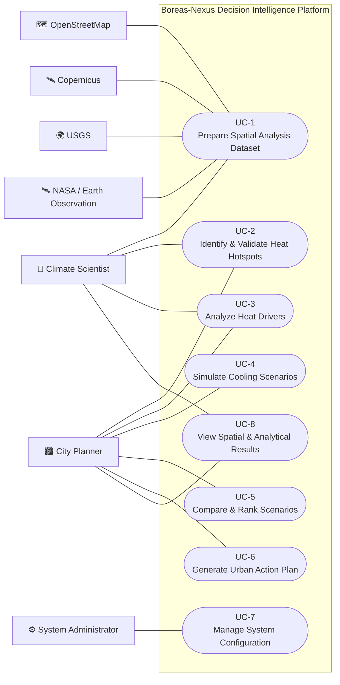
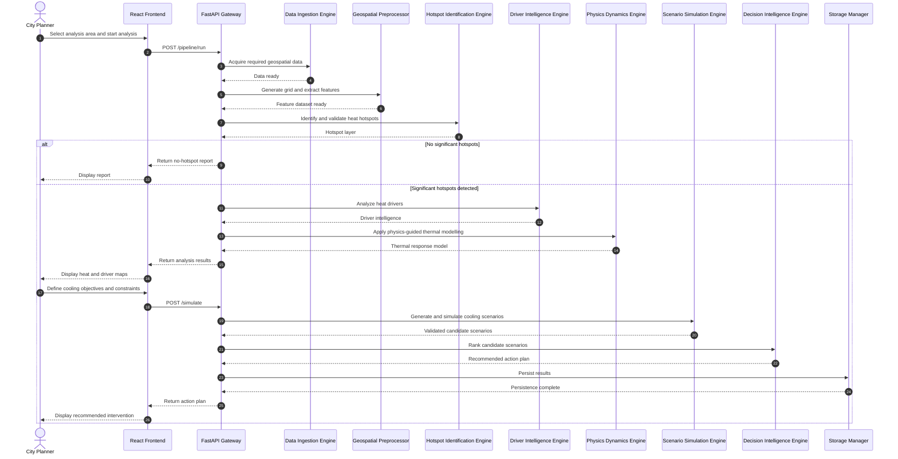
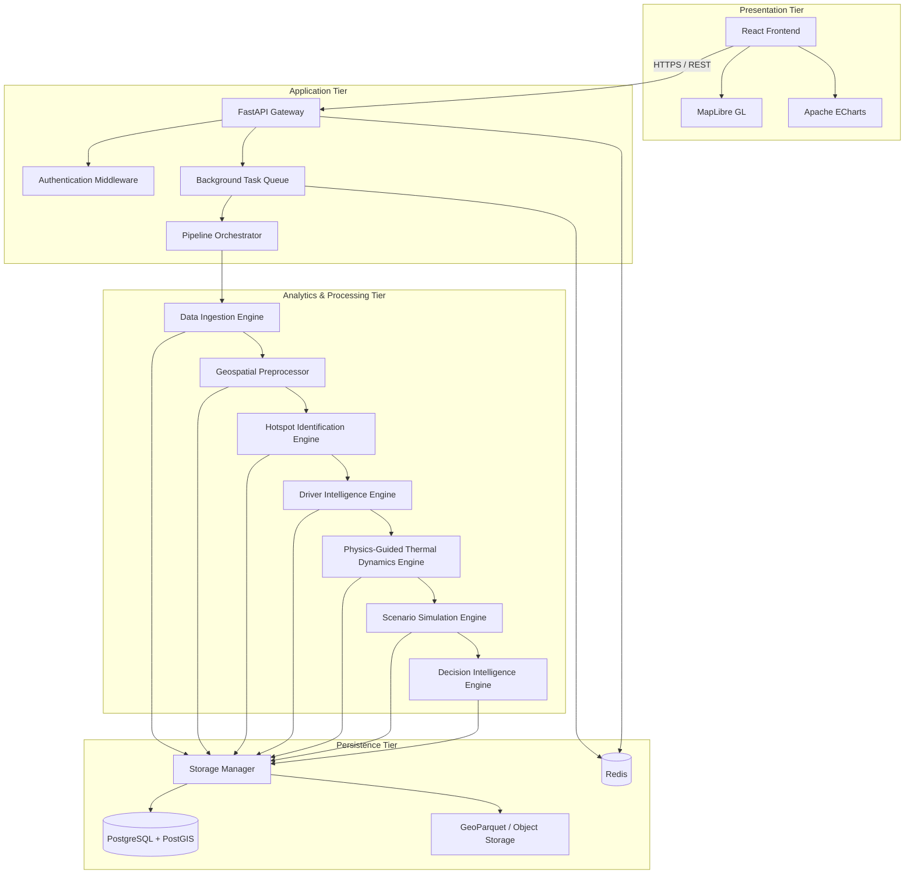
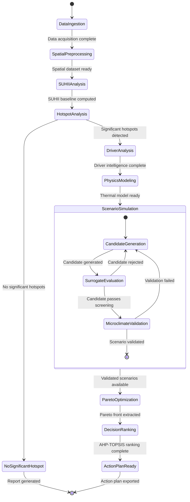
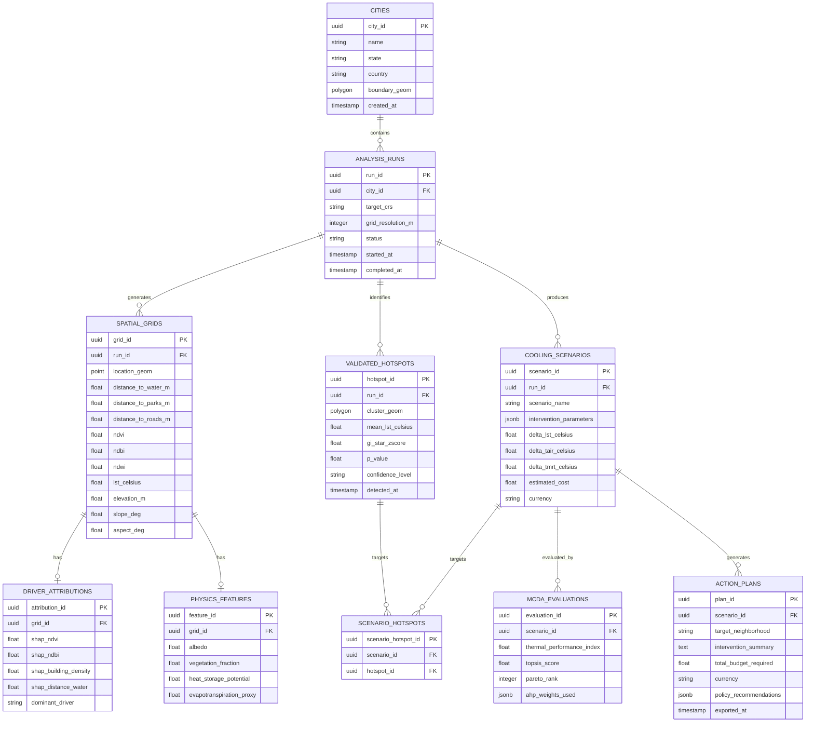
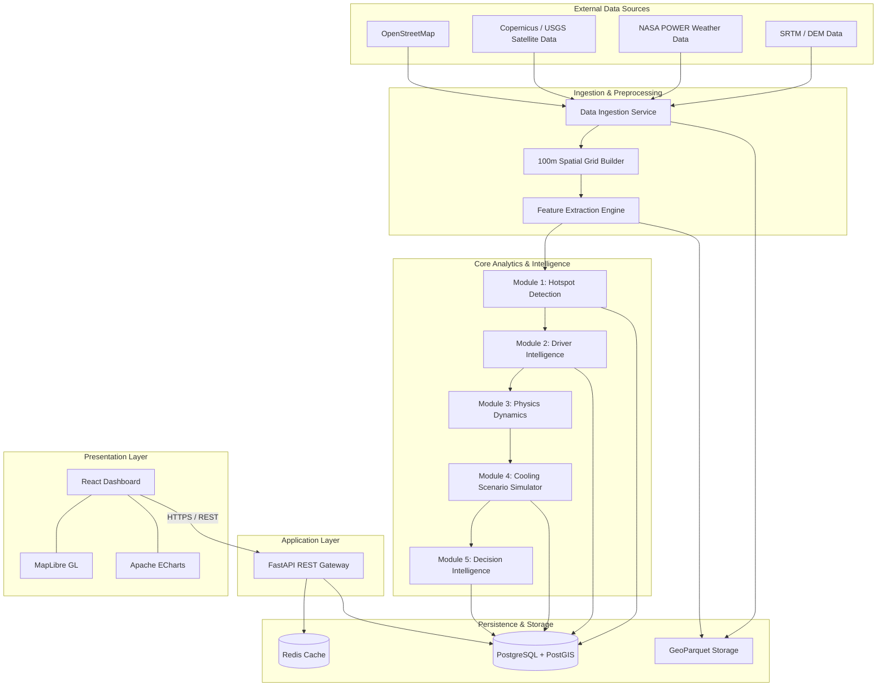

# Boreas-Nexus: Physics-Informed Urban Heat Island Decision Intelligence & Cooling Infrastructure Optimization Engine

[](https://www.python.org/)
[](https://geopandas.org/)
[](https://lightgbm.readthedocs.io/)
[](https://shap.readthedocs.io/)
[](https://postgis.net/)
[](LICENSE)
[](#13-pipeline-execution--empirical-validation)

---

## 📌 Table of Contents
- [1. Finalized Title & Metadata](#1-finalized-title--metadata)
- [2. Abstract (Draft)](#2-abstract-draft)
- [3. Problem Statement](#3-problem-statement)
- [4. Project Objectives](#4-project-objectives)
- [5. Scope of the Project](#5-scope-of-the-project)
- [6. Literature Survey & Comparative Matrix](#6-literature-survey--comparative-matrix)
  - [6.1 Core Mathematical & Physical Formulations](#61-core-mathematical--physical-formulations)
- [7. Tools & Technologies](#7-tools--technologies)
- [8. Software Requirements Specification (SRS)](#8-software-requirements-specification-srs)
  - [8.1 Functional Requirements (FR)](#81-functional-requirements-fr)
  - [8.2 Non-Functional Requirements (NFR)](#82-non-functional-requirements-nfr)
- [9. UML Diagrams](#9-uml-diagrams)
  - [9.1 Class Diagram](#91-class-diagram)
  - [9.2 Activity Diagram](#92-activity-diagram)
  - [9.3 Use Case Diagram](#93-use-case-diagram)
  - [9.4 Sequence Diagram](#94-sequence-diagram)
  - [9.5 Component Diagram](#95-component-diagram)
  - [9.6 State Machine Diagram](#96-state-machine-diagram)
  - [9.7 Dashboard UI & Wireframe Layout](#97-dashboard-ui--wireframe-layout)
- [10. Enhanced Entity-Relationship (EER) Diagram](#10-enhanced-entity-relationship-eer-diagram)
- [11. Database Design (PostgreSQL + PostGIS Schema)](#11-database-design-postgresql--postgis-schema)
- [12. System Architecture Diagram](#12-system-architecture-diagram)
- [13. Pipeline Execution & Empirical Validation](#13-pipeline-execution--empirical-validation)
- [14. Getting Started & Installation](#14-getting-started--installation)
- [15. License & Citation](#15-license--citation)

---

## 1. Finalized Title & Metadata

**Full Project Title:**  
`Boreas-Nexus: Physics-Informed Urban Heat Island Decision Intelligence & Cooling Infrastructure Optimization Engine`

**Short Title / Codename:** `Boreas-Nexus`  
**Domain:** Geospatial Artificial Intelligence (GeoAI), Remote Sensing, Urban Microclimate Physics, Multi-Criteria Decision Analysis (MCDA)  
**Target Stakeholders:** Urban Planners, Municipal Corporations, Climate Resilience Officers, GIS Analysts  
**Primary Study Region (Empirical Validation):** Chennai Metropolitan Area, Tamil Nadu, India ($13.0827^\circ\text{ N}, 80.2707^\circ\text{ E}$)

---

## 2. Abstract (Draft)

Rapid urbanization and spatial land-use conversion have intensified the **Urban Heat Island (UHI)** effect globally, elevating Land Surface Temperature (LST), compounding heat-wave mortality, and driving building energy demands. Traditional UHI assessment methods suffer from three systemic shortcomings: (1) treating temperature prediction as an end-state without attributing driving causes, (2) relying on unconstrained machine learning models that generate physically implausible recommendations, and (3) offering static intervention advice without simulating microclimate feedback loops or pedestrian thermal comfort.

**Boreas-Nexus** addresses these limitations by introducing an end-to-end, physics-informed decision intelligence framework structured across five interconnected engineering modules:
1. **Module 1 (Urban Heat Hotspot Identification Engine):** Combines Surface Urban Heat Island Intensity ($\text{SUHII}$), nocturnal thermal persistence analysis, and spatial autocorrelation via Getis-Ord $Gi^*$ statistical clustering to isolate true urban heat hotspots from localized spatial noise.
2. **Module 2 (Urban Heat Driver Intelligence Engine):** Employs non-linear tree-boosting algorithms (XGBoost/LightGBM), SHapley Additive exPlanations (SHAP), and Geographically Weighted Regression (GWR) to quantify spatial non-stationarity and attribute local heating drivers (vegetation deficits, impervious cover, morphology).
3. **Module 3 (Physics-Guided Urban Heat Dynamics Engine):** Integrates Surface Energy Balance (SEB) physical constraints into machine learning surrogate models to map dynamic continuous thermal responses ($\Delta\text{LST}$).
4. **Module 4 (Cooling Scenario Simulation Engine):** Utilizes multi-objective search algorithms (Genetic Algorithms / Bayesian Optimization) coupled with microclimate validation engines (InVEST for air temperature $\Delta T_{\text{air}}$ and SOLWEIG for pedestrian mean radiant temperature $\Delta T_{\text{mrt}}$).
5. **Module 5 (Urban Climate Decision Intelligence Engine):** Applies Non-Dominated Sorting (Pareto analysis), Analytic Hierarchy Process (AHP), and Technique for Order of Preference by Similarity to Ideal Solution (TOPSIS) to rank policy-ready, cost-effective urban action plans.

Empirical evaluation on Chennai, India over **44,298 spatial grid cells** at 100-meter resolution demonstrates robust feature extraction across 11 physical attributes, full statistical hotspot validation, and automated generation of policy-ready cooling interventions.

---

## 3. Problem Statement

Most modern urban climate research and AI platforms stop after predicting Land Surface Temperature (LST) or visualizing heat maps on spatial dashboards. This creates a critical gap between academic remote sensing and actionable urban planning:

```
[ Current Paradigm ]
Satellite Data ──► LST Heatmap ──► (STOP) ──► Generic Advice ("Plant Trees")

[ Boreas-Nexus Paradigm ]
Satellite + GIS ──► Hotspot Gi* ──► SHAP Attribution ──► Physics SEB ──► GA Simulation ──► MCDA Action Plan
```

### Core Research & Operational Deficiencies:
1. **Prediction Without Explanation:** Standard deep learning models predict $T_{\text{surface}}$ as a black box without identifying *why* a neighborhood is hot (e.g., distinguishing between high building density vs. low canopy vs. low albedo).
2. **Physically Unconstrained Modeling:** Purely statistical models often suggest interventions that violate basic urban energy balances (e.g., predicting that increasing wind speed elevates surface temperature).
3. **Absence of Multi-Metric Scenario Simulation:** Planners cannot answer *"What happens if we increase tree canopy by 20% along corridor X?"* across surface temperature, air temperature, and pedestrian radiant comfort simultaneously.
4. **Neglect of Night-Time Heat Persistence:** Most studies rely solely on daytime thermal remote sensing, ignoring nocturnal heat retention by urban mass—which is the primary driver of heat-related human health risks in tropical cities.
5. **Lack of Closed-Loop Feedback:** Recommendations are rarely monitored against post-intervention satellite observations to update model weights as cities evolve.

---

## 4. Project Objectives

### Primary Objective
To construct a unified, open-source, physics-guided geospatial decision-support engine that ingests multi-source Earth observation data, identifies and attributes urban heat hotspots, simulates microclimate cooling interventions, and produces cost-optimized, policy-ready action plans for city planners.

### Module-Wise Objectives

| Module | Official Title | Core Scientific Question | Primary Objective |
| :--- | :--- | :--- | :--- |
| **Module 1** | **Urban Heat Hotspot Identification Engine** | *Where is the problem?* | Extract statistically significant UHI hotspots using $\text{SUHII}$, nocturnal thermal persistence, and Getis-Ord $Gi^*$ clustering. |
| **Module 2** | **Urban Heat Driver Intelligence Engine** | *Why does it exist?* | Quantify and spatially map local heat drivers using XGBoost, LightGBM, SHAP attribution, and Geographically Weighted Regression (GWR). |
| **Module 3** | **Physics-Guided Urban Heat Dynamics Engine** | *How do physical drivers interact?* | Model dynamic heat transfer using machine learning constrained by Surface Energy Balance (SEB) physical rules. |
| **Module 4** | **Cooling Scenario Simulation Engine** | *What happens if we redesign the city?* | Search thousands of intervention combinations using Genetic Algorithms, validated via InVEST ($\Delta T_{\text{air}}$) and SOLWEIG ($\Delta T_{\text{mrt}}$). |
| **Module 5** | **Urban Climate Decision Intelligence Engine** | *What is the optimal intervention strategy?* | Derive Pareto-optimal intervention strategies using AHP and TOPSIS multi-criteria decision analysis to export policy action plans. |

---

## 5. Scope of the Project

### In-Scope Functional Capabilities
- **Multi-Source Data Ingestion Pipeline:** Automated fetchers for OpenStreetMap vector layers (roads, buildings, parks, land use, water, railways, vegetation), Sentinel-2 MSI (10m spectral indices: NDVI, NDBI, NDWI), Landsat-8 TIRS (30m thermal LST), SRTM DEM (30m elevation/slope/aspect), and NASA POWER daily meteorological timeseries.
- **Unified Geospatial Grid Preprocessor:** Standardizing heterogenous rasters and vectors into a unified 100m EPSG:4326 centroid spatial grid (GeoParquet & GeoJSON columnar storage).
- **Statistical Hotspot & Driver Analytics:** Automated computation of Getis-Ord $Gi^*$, SHAP feature attribution graphs, and GWR spatial coefficient maps.
- **Intervention Search & Physics Validation Engine:** Multi-objective scenario generator assessing Cool Roofs, Green Roofs, Urban Canopy Extension, Reflective Pavements, and Surface Water Expansion.
- **Interactive GIS Dashboard & Decision Interface:** MapLibre GL frontend backed by FastAPI REST API and PostgreSQL/PostGIS database.

### Out-of-Scope (Future Architectural Horizons)
- Real-time IoT weather station mesh network telemetry via MQTT/LoRaWAN.
- Mobile native application development (iOS/Android) for ground-truth field surveys.
- 3D Digital Twin volumetric mesh rendering via CesiumJS.

---

## 6. Literature Survey & Comparative Matrix

### Key Academic Foundations

1. **Urban Heat Island Dynamics in Tropical/Indian Cities (Siddiqui et al., 2024/2025):**
   - *Key Insight:* Nocturnal Land Surface Temperature is a significantly more robust indicator of urban heat retention than daytime LST due to daytime solar heating noise.
   - *Adoption in Boreas-Nexus:* Module 1 incorporates explicit Day/Night thermal persistence filtering to isolate persistent structural heat zones.
2. **UHI Mitigation Technologies & Microclimate Review (2026):**
   - *Key Insight:* Single-intervention strategies (e.g., tree planting alone) yield diminishing returns compared to hybrid interventions combining high-albedo cool roofs with vegetation canopy.
   - *Adoption in Boreas-Nexus:* Module 4 simulates multi-variable hybrid scenarios (Cool Roofs + Green Roofs + Permeable Pavements).
3. **Explainable AI in Urban Climate Modeling (Lundberg & Lee, SHAP Framework):**
   - *Key Insight:* Global feature importance models mask local spatial variability. Localized SHAP values enable pixel-level attribution.
   - *Adoption in Boreas-Nexus:* Module 2 couples LightGBM with localized SHAP summary values to explain individual hotspot clusters.
4. **Physics-Informed Machine Learning & Surface Energy Balance (Karniadakis et al., 2021):**
   - *Key Insight:* Machine learning models constrained by physical conservation laws prevent unphysical gradient steps during optimization.
   - *Adoption in Boreas-Nexus:* Module 3 embeds Surface Energy Balance constraints into feature engineering and loss penalty functions.
5. **Multi-Criteria Decision Analysis in Urban Planning (Saaty AHP & Hwang TOPSIS):**
   - *Key Insight:* Planning decisions must balance conflicting trade-offs between thermal efficiency, financial capital costs, and population equity.
   - *Adoption in Boreas-Nexus:* Module 5 uses non-dominated sorting followed by AHP-TOPSIS ranking.

### Comparative Feature Matrix

| System Feature / Capability | Standard GIS Dashboards | Deep Learning LST Predictors | Traditional Urban Climate Models (ENVI-met) | **Boreas-Nexus (Our Platform)** |
| :--- | :---: | :---: | :---: | :---: |
| **Multi-Source Automated Ingestion** | Partial (Manual) | Scripted | Manual CAD/GIS File Prep | **Automated (OSM, Sentinel, Landsat, NASA POWER)** |
| **Hotspot Statistical Validation** | Threshold-based | ❌ None | ❌ None | **Getis-Ord $Gi^*$ + SUHII Baseline** |
| **Explainable AI Attribution** | ❌ None | ❌ None (Black box) | ❌ None | **SHAP + GWR Spatial Non-Stationarity** |
| **Physics-Informed Machine Learning**| ❌ None | Rare | Full Physics (Very Slow) | **Hybrid Machine Learning + SEB Constraints** |
| **Automated Scenario Generation** | ❌ None | ❌ None | Manual (One-by-one) | **Search-Driven Optimization (GA / Bayesian)** |
| **Pedestrian Comfort Validation** | ❌ None | ❌ None | $\text{SOLWEIG } T_{\text{mrt}}$ | **Multi-Scale Validation ($\Delta LST, \Delta T_{\text{air}}, \Delta T_{\text{mrt}}$)** |
| **Decision Science / MCDA Engine** | ❌ None | ❌ None | ❌ None | **Pareto Sorting + AHP-TOPSIS Action Plans** |
| **Post-Intervention Feedback Loop** | ❌ None | ❌ None | ❌ None | **Active Learning Satellite Audit** |

---

### 6.1 Core Mathematical & Physical Formulations

#### 1. Surface Urban Heat Island Intensity ($\text{SUHII}$)
$$\text{SUHII}_i = \text{LST}_i - \mu\left(\text{LST}_{\text{rural}}\right) = \text{LST}_i - \frac{1}{N_{\text{rural}}} \sum_{j \in \text{Rural}} \text{LST}_j$$

#### 2. Getis-Ord $Gi^*$ Local Spatial Autocorrelation Statistic
$$Gi^*_i = \frac{\sum_{j=1}^n w_{ij} x_j - \bar{X} \sum_{j=1}^n w_{ij}}{S \sqrt{\frac{n \sum_{j=1}^n w_{ij}^2 - \left(\sum_{j=1}^n w_{ij}\right)^2}{n - 1}}}$$

where $\bar{X} = \frac{\sum_{j=1}^n x_j}{n}$ and $S = \sqrt{\frac{\sum_{j=1}^n x_j^2}{n} - (\bar{X})^2}$.

#### 3. Surface Energy Balance ($\text{SEB}$) Physical Conservation Law
$$R_n = H + LE + G + Q_a$$

where $R_n$ is net surface radiation, $H$ is sensible heat flux, $LE$ is latent heat flux (evapotranspiration), $G$ is ground heat storage, and $Q_a$ is anthropogenic heat flux.

#### 4. SHapley Additive exPlanations (SHAP Value Attribution)
$$\phi_i(x) = \sum_{S \subseteq F \setminus \{i\}} \frac{|S|!(|F| - |S| - 1)!}{|F|!} \left[ f_x(S \cup \{i\}) - f_x(S) \right]$$

where $F$ is the complete feature set, $S$ is a feature subset, and $f_x(S)$ is the model expectation conditioned on features in $S$.

#### 5. TOPSIS Relative Closeness Coefficient ($C_i^*$)
$$C_i^* = \frac{D_i^-}{D_i^+ + D_i^-}, \quad 0 \le C_i^* \le 1$$

where $D_i^+$ is the Euclidean distance to the positive-ideal solution and $D_i^-$ is the distance to the negative-ideal solution.

---

## 7. Tools & Technologies

| Layer / Subsystem | Primary Technology | Purpose & Usage |
| :--- | :--- | :--- |
| **Programming Language** | Python 3.10+ | Core data pipelines, backend API, analytics engines |
| **Geospatial Processing** | `geopandas`, `rasterio`, `shapely`, `osmnx`, `pyproj`, `fiona`, `rioxarray`, `pysal` | Spatial vector processing, raster masking, CRS conversions, topological proximity computations |
| **Satellite Data Acquisition** | `pystac-client`, `planetary-computer`, NASA POWER REST API | Ingestion of Sentinel-2 MSI, Landsat-8 TIRS, SRTM DEM, and meteorological observations |
| **Machine Learning & Analytics** | `scikit-learn`, `lightgbm`, `xgboost`, `shap`, `mgwr`, `scipy` | Baseline driver modeling, non-linear boosting, explainable AI attribution, Geographically Weighted Regression |
| **Optimization & Decision Science**| `pymoo` (NSGA-II), `scipy.optimize`, Custom TOPSIS/AHP Engine | Multi-objective Pareto search, constraint optimization, multi-criteria scenario ranking |
| **Database & Spatial Storage** | PostgreSQL 16 + PostGIS 3.4 | Spatial persistence, vector polygon queries, spatial index ($GiST$), metadata tracking |
| **Data Storage Formats** | Apache GeoParquet, GeoJSON, Cloud-Optimized GeoTIFF (COG) | High-performance columnar feature matrices (4.46 MB for 44,298 sample points) |
| **Backend Web Framework** | FastAPI (ASGI) | High-throughput asynchronous REST API gateway, Pydantic validation, OpenAPI documentation |
| **Frontend Web Interface** | React 18 (Vite), MapLibre GL JS, Material UI, Tailwind CSS, Apache ECharts | Interactive map visualizer, layer controls, scenario sliders, MCDA trade-off charts |
| **Testing & Quality Control** | `pytest`, `pytest-cov`, `flake8` | Unit testing, integration validation, data integrity checks |

---

## 8. Software Requirements Specification (SRS)

### 8.1 Functional Requirements (FR)

- **FR-1 (Data Ingestion):** The system shall automatically ingest administrative boundary polygons, OSM vector layers, Sentinel-2 spectral rasters, Landsat-8 thermal scenes, SRTM DEM, and NASA POWER weather datasets for any targeted city.
- **FR-2 (Spatial Feature Extraction):** The system shall generate a uniform spatial point grid at 100m resolution and calculate 11+ physical domain attributes: Euclidean distances to water, parks, and roads; spectral indices (NDVI, NDBI, NDWI); thermal LST; elevation; slope; and aspect.
- **FR-3 (Urban Heat Hotspot Detection):** The system shall delineate urban vs. rural land cover, calculate Surface Urban Heat Island Intensity ($\text{SUHII}$), isolate nocturnal heat persistence, and run Getis-Ord $Gi^*$ clustering to identify statistically significant hotspots ($Z > 1.96, p < 0.05$).
- **FR-4 (Explainable Driver Attribution):** The system shall train LightGBM/XGBoost models to predict LST, compute SHAP attribution scores for every hotspot cell, and execute GWR to map spatial non-stationarity across neighborhoods.
- **FR-5 (Physics-Guided Dynamics Engine):** The system shall enforce Surface Energy Balance physical constraints ($\text{SEB} = R_n - G - H - LE = 0$) during thermal response modeling.
- **FR-6 (Cooling Scenario Simulation):** The system shall provide an optimization search interface (GA/Bayesian) enabling users to simulate custom or automated urban interventions (canopy extension, cool roofs, green roofs, albedo changes).
- **FR-7 (Physics Validation Engine):** The system shall evaluate top candidate scenarios using InVEST ($\Delta T_{\text{air}}$) and SOLWEIG ($\Delta T_{\text{mrt}}$) models to confirm city-scale air cooling and pedestrian radiant comfort gains.
- **FR-8 (Multi-Criteria Decision Engine):** The system shall apply Pareto Non-Dominated Sorting, AHP weight assignment, and TOPSIS MCDA ranking across thermal efficiency, life-cycle costs, equity, and implementation feasibility.
- **FR-9 (Interactive Action Plan Reporting):** The system shall render interactive spatial layers in MapLibre GL and export policy-ready PDF/JSON urban climate action plans.

### 8.2 Non-Functional Requirements (NFR)

- **NFR-1 (Performance & Speed):** The preprocessing pipeline shall extract features across 45,000 grid points in under 60 seconds on standard 8-core workstations.
- **NFR-2 (Scalability & Memory Efficiency):** Data storage shall utilize columnar GeoParquet compression to keep total dataset footprints under 5 MB per 45,000 sample points.
- **NFR-3 (Reliability & Data Quality):** The pipeline shall guarantee zero NaN/missing values in output matrices and validate Coordinate Reference Systems (target `EPSG:4326`) across all layers prior to model execution.
- **NFR-4 (Security & Access Control):** The REST API shall enforce JSON Web Token (JWT) authentication and role-based access for municipal administrative routes.
- **NFR-5 (Auditability & Explainability):** All generated urban action plans shall include complete model provenance logs, SHAP attribution summaries, and confidence intervals ($\pm^\circ\text{C}$).

---

## 9. UML Diagrams

### 9.1 Class Diagram

```mermaid
classDiagram
    direction LR

    class DataIngestionEngine {
        -config_path : Path
        -vector_layers : List~str~
        -spatial_boundary : Polygon
        +fetch_osm_vectors()
        +fetch_sentinel_landsat()
        +fetch_weather_dem()
    }

    class GeospatialPreprocessor {
        -grid_resolution_meters : int
        -target_crs : str
        -feature_columns : List~str~
        +generate_100m_grid()
        +compute_vector_proximities()
        +calculate_spectral_indices()
    }

    class HotspotIdentificationEngine {
        -urban_mask : GeoSeries
        -suhii_baseline : float
        -gi_star_threshold : float
        +compute_suhii_baseline()
        +analyze_nocturnal_persistence()
        +validate_getis_ord_gi_star()
    }

    class DriverIntelligenceEngine {
        -booster_model : LGBMRegressor
        -shap_explainer : TreeExplainer
        -gwr_bandwidth : float
        +train_boosted_driver_model()
        +compute_shap_attributions()
        +fit_gwr_spatial_coefficients()
    }

    class PhysicsDynamicsEngine {
        -seb_tolerance : float
        -albedo_matrix : ndarray
        -heat_capacity : float
        +construct_energy_balance_features()
        +enforce_surface_energy_balance()
        +predict_thermal_response()
    }

    class ScenarioSimulationEngine {
        -ga_population_size : int
        -max_generations : int
        -invest_model : UrbanCoolingModel
        +run_ga_scenario_search()
        +validate_invest_air_temp()
        +validate_solweig_radiant_comfort()
    }

    class DecisionIntelligenceEngine {
        -ahp_pairwise_matrix : ndarray
        -pareto_front : List~Scenario~
        -topsis_scores : DataFrame
        +extract_pareto_front()
        +compute_ahp_weights()
        +rank_topsis_scenarios()
        +export_urban_action_plan()
    }

    class StorageManager {
        -base_dir : Path
        -processed_dir : Path
        -export_dir : Path
        +save_geoparquet()
        +load_geoparquet()
        +persist_postgis_registry()
    }

    class FastAPIGateway {
        -app : FastAPI
        -router : APIRouter
        -jwt_secret : str
        +run_pipeline_endpoint()
        +simulate_scenario_endpoint()
        +export_plan_endpoint()
    }

    class DashboardInterface {
        -map_instance : MapLibreGL
        -active_layers : List~str~
        -selected_scenario : Dict
        +render_maplibre_layers()
        +display_echarts_pareto()
        +trigger_simulation()
    }

    %% Core Processing Pipeline
DataIngestionEngine ..> GeospatialPreprocessor : provides data
GeospatialPreprocessor ..> HotspotIdentificationEngine : provides features
HotspotIdentificationEngine ..> DriverIntelligenceEngine : provides hotspots
DriverIntelligenceEngine ..> PhysicsDynamicsEngine : provides driver insights
PhysicsDynamicsEngine ..> ScenarioSimulationEngine : provides thermal model
ScenarioSimulationEngine ..> DecisionIntelligenceEngine : provides scenarios

%% Cross-cutting persistence
DataIngestionEngine ..> StorageManager : persists raw data
GeospatialPreprocessor ..> StorageManager : persists features
HotspotIdentificationEngine ..> StorageManager : persists hotspots
DriverIntelligenceEngine ..> StorageManager : persists explanations
PhysicsDynamicsEngine ..> StorageManager : persists models
ScenarioSimulationEngine ..> StorageManager : persists scenarios
DecisionIntelligenceEngine ..> StorageManager : persists decisions

%% Application layer
FastAPIGateway ..> DecisionIntelligenceEngine : exposes results
FastAPIGateway ..> ScenarioSimulationEngine : triggers simulations
FastAPIGateway ..> StorageManager : accesses persisted data

%% Presentation layer
DashboardInterface ..> FastAPIGateway : calls API
```



---

### 9.2 Activity Diagram

```mermaid
flowchart TD

    %% ==========================================
    %% BOREAS-NEXUS — UML ACTIVITY DIAGRAM
    %% ==========================================

    Start((Start))

    A1["Configure Urban Analysis"]

    %% -------- Data Acquisition --------

    A2["Acquire OSM Vector Data"]
    A3["Acquire Satellite Data"]
    A4["Acquire DEM Data"]
    A5["Acquire Weather Data"]

    D1{"All Required Data Available?"}

    %% -------- Preprocessing --------

    A6["Preprocess and Harmonize Data"]
    A7["Generate 100 m Analysis Grid"]
    A8["Compute Spatial and Spectral Features"]

    %% -------- Module 1 --------

    A9["Compute SUHII Baseline"]
    A10["Detect Thermal Hotspots using Getis-Ord Gi*"]

    D2{"Significant Hotspots Identified?"}

    A11["Generate No Significant Hotspot Report"]

    %% -------- Module 2 --------

    A12["Train LightGBM Driver Model"]
    A13["Compute SHAP Feature Attributions"]
    A14["Fit Spatial Driver Relationships using GWR"]

    %% -------- Module 3 --------

    A15["Construct Physics-Informed Features"]
    A16["Apply Surface Energy-Balance Constraints"]
    A17["Predict Thermal Response"]

    %% -------- Module 4 --------

    A18["Generate Candidate Cooling Scenarios"]
    A19["Search Scenario Space using Genetic Algorithm"]
    A20["Simulate Thermal Response"]
    A21["Validate Microclimate Response"]

    D3{"Scenario Validation Successful?"}

    %% -------- Module 5 --------

    A22["Extract Pareto-Optimal Scenarios"]
    A23["Compute AHP Objective Weights"]
    A24["Rank Scenarios using TOPSIS"]

    %% -------- Output --------

    A25["Generate Urban Action Plan"]
    A26["Persist Spatial Results and Action Plan"]
    A27["Expose Results through FastAPI"]
    A28["Render Interactive Map and Analytics Dashboard"]

    End1(((Action Plan Complete)))
    End2(((No Significant Hotspot Report Complete)))

    %% ==========================================
    %% MAIN WORKFLOW
    %% ==========================================

    Start --> A1

    %% Data acquisition
    A1 --> A2
    A1 --> A3
    A1 --> A4
    A1 --> A5

    A2 --> D1
    A3 --> D1
    A4 --> D1
    A5 --> D1

    D1 -->|Yes| A6
    D1 -->|No| A1

    %% Preprocessing
    A6 --> A7
    A7 --> A8

    %% Module 1 — Hotspot Identification
    A8 --> A9
    A9 --> A10
    A10 --> D2

    %% No significant hotspots
    D2 -->|No| A11
    A11 --> End2

    %% Significant hotspots
    D2 -->|Yes| A12

    %% Module 2 — Driver Intelligence
    A12 --> A13
    A13 --> A14

    %% Module 3 — Physics Dynamics
    A14 --> A15
    A15 --> A16
    A16 --> A17

    %% Module 4 — Scenario Simulation
    A17 --> A18
    A18 --> A19
    A19 --> A20
    A20 --> A21

    %% Scenario validation
    A21 --> D3

    D3 -->|No| A18
    D3 -->|Yes| A22

    %% Module 5 — Decision Intelligence
    A22 --> A23
    A23 --> A24

    %% Final output
    A24 --> A25
    A25 --> A26
    A26 --> A27
    A27 --> A28

    A28 --> End1
```



---

### 9.3 Use Case Diagram



---

### 9.4 Sequence Diagram



---

### 9.5 Component Diagram



---

### 9.6 State Machine Diagram



---


## 10. Enhanced Entity-Relationship (EER) Diagram



---

## 11. Database Design (PostgreSQL + PostGIS Schema)

Production-grade SQL DDL code snippet for initializing the spatial database schema:

```sql
-- ============================================================
-- Boreas-Nexus Database Schema
-- PostgreSQL 18 + PostGIS
-- UUIDv7
-- ============================================================

CREATE EXTENSION IF NOT EXISTS postgis;


-- ============================================================
-- 1. CITIES
-- ============================================================

CREATE TABLE cities (
    city_id UUID PRIMARY KEY DEFAULT uuidv7(),

    name VARCHAR(100) NOT NULL,
    state VARCHAR(100) NOT NULL,
    country VARCHAR(100) NOT NULL,

    boundary_geom GEOMETRY(Polygon, 4326) NOT NULL,

    created_at TIMESTAMPTZ DEFAULT CURRENT_TIMESTAMP,

    CONSTRAINT uq_city_identity
        UNIQUE (name, state, country)
);


-- ============================================================
-- 2. ANALYSIS RUNS
-- ============================================================

CREATE TABLE analysis_runs (
    run_id UUID PRIMARY KEY DEFAULT uuidv7(),

    city_id UUID NOT NULL
        REFERENCES cities(city_id)
        ON DELETE CASCADE,

    target_crs VARCHAR(20) NOT NULL DEFAULT 'EPSG:4326',
    grid_resolution_m INTEGER NOT NULL DEFAULT 100,

    status VARCHAR(30) NOT NULL
        CHECK (
            status IN (
                'PENDING',
                'RUNNING',
                'COMPLETED',
                'FAILED'
            )
        ),

    started_at TIMESTAMPTZ DEFAULT CURRENT_TIMESTAMP,
    completed_at TIMESTAMPTZ,

    CONSTRAINT chk_grid_resolution
        CHECK (grid_resolution_m > 0),

    CONSTRAINT chk_run_dates
        CHECK (
            completed_at IS NULL
            OR completed_at >= started_at
        )
);


-- ============================================================
-- 3. SPATIAL GRIDS
-- ============================================================

CREATE TABLE spatial_grids (
    grid_id UUID PRIMARY KEY DEFAULT uuidv7(),

    run_id UUID NOT NULL
        REFERENCES analysis_runs(run_id)
        ON DELETE CASCADE,

    location_geom GEOMETRY(Point, 4326) NOT NULL,

    distance_to_water_m NUMERIC(10, 2),
    distance_to_parks_m NUMERIC(10, 2),
    distance_to_roads_m NUMERIC(10, 2),

    ndvi NUMERIC(6, 4),
    ndbi NUMERIC(6, 4),
    ndwi NUMERIC(6, 4),

    lst_celsius NUMERIC(5, 2),

    elevation_m NUMERIC(6, 2),
    slope_deg NUMERIC(5, 2),
    aspect_deg NUMERIC(5, 2),

    created_at TIMESTAMPTZ DEFAULT CURRENT_TIMESTAMP
);

CREATE INDEX idx_spatial_grids_geom
    ON spatial_grids USING GIST (location_geom);

CREATE INDEX idx_spatial_grids_run
    ON spatial_grids (run_id);


-- ============================================================
-- 4. VALIDATED HOTSPOTS
-- ============================================================

CREATE TABLE validated_hotspots (
    hotspot_id UUID PRIMARY KEY DEFAULT uuidv7(),

    run_id UUID NOT NULL
        REFERENCES analysis_runs(run_id)
        ON DELETE CASCADE,

    cluster_geom GEOMETRY(Polygon, 4326) NOT NULL,

    mean_lst_celsius NUMERIC(5, 2) NOT NULL,
    gi_star_zscore NUMERIC(6, 3) NOT NULL,
    p_value NUMERIC(6, 5) NOT NULL,

    confidence_level VARCHAR(20)
        CHECK (
            confidence_level IN ('90%', '95%', '99%')
        ),

    detected_at TIMESTAMPTZ DEFAULT CURRENT_TIMESTAMP
);

CREATE INDEX idx_validated_hotspots_geom
    ON validated_hotspots USING GIST (cluster_geom);

CREATE INDEX idx_validated_hotspots_run
    ON validated_hotspots (run_id);


-- ============================================================
-- 5. DRIVER ATTRIBUTIONS
-- ============================================================

CREATE TABLE driver_attributions (
    attribution_id UUID PRIMARY KEY DEFAULT uuidv7(),

    grid_id UUID NOT NULL
        REFERENCES spatial_grids(grid_id)
        ON DELETE CASCADE,

    shap_ndvi NUMERIC(6, 3),
    shap_ndbi NUMERIC(6, 3),
    shap_building_density NUMERIC(6, 3),
    shap_distance_water NUMERIC(6, 3),

    dominant_driver VARCHAR(50) NOT NULL,

    CONSTRAINT uq_driver_grid
        UNIQUE (grid_id)
);


-- ============================================================
-- 6. PHYSICS FEATURES
-- ============================================================

CREATE TABLE physics_features (
    feature_id UUID PRIMARY KEY DEFAULT uuidv7(),

    grid_id UUID NOT NULL
        REFERENCES spatial_grids(grid_id)
        ON DELETE CASCADE,

    albedo NUMERIC(6, 4),
    vegetation_fraction NUMERIC(6, 4),
    heat_storage_potential NUMERIC(10, 4),
    evapotranspiration_proxy NUMERIC(10, 4),

    CONSTRAINT uq_physics_grid
        UNIQUE (grid_id)
);


-- ============================================================
-- 7. COOLING SCENARIOS
-- ============================================================

CREATE TABLE cooling_scenarios (
    scenario_id UUID PRIMARY KEY DEFAULT uuidv7(),

    run_id UUID NOT NULL
        REFERENCES analysis_runs(run_id)
        ON DELETE CASCADE,

    scenario_name VARCHAR(150) NOT NULL,

    intervention_parameters JSONB NOT NULL,

    delta_lst_celsius NUMERIC(6, 2),
    delta_tair_celsius NUMERIC(6, 2),
    delta_tmrt_celsius NUMERIC(6, 2),

    estimated_cost NUMERIC(12, 2),
    currency_code CHAR(3) NOT NULL DEFAULT 'INR',

    created_at TIMESTAMPTZ DEFAULT CURRENT_TIMESTAMP
);

CREATE INDEX idx_cooling_scenarios_run
    ON cooling_scenarios (run_id);


-- ============================================================
-- 8. SCENARIO HOTSPOTS
-- ============================================================

CREATE TABLE scenario_hotspots (
    scenario_hotspot_id UUID PRIMARY KEY DEFAULT uuidv7(),

    scenario_id UUID NOT NULL
        REFERENCES cooling_scenarios(scenario_id)
        ON DELETE CASCADE,

    hotspot_id UUID NOT NULL
        REFERENCES validated_hotspots(hotspot_id)
        ON DELETE CASCADE,

    CONSTRAINT uq_scenario_hotspot
        UNIQUE (scenario_id, hotspot_id)
);


-- ============================================================
-- 9. MCDA EVALUATIONS
-- ============================================================

CREATE TABLE mcda_evaluations (
    evaluation_id UUID PRIMARY KEY DEFAULT uuidv7(),

    scenario_id UUID NOT NULL
        REFERENCES cooling_scenarios(scenario_id)
        ON DELETE CASCADE,

    thermal_performance_index NUMERIC(5, 4) NOT NULL,
    topsis_score NUMERIC(5, 4) NOT NULL,
    pareto_rank INTEGER NOT NULL,

    ahp_weights_used JSONB NOT NULL,

    evaluation_context VARCHAR(100),

    CONSTRAINT chk_pareto_rank
        CHECK (pareto_rank >= 0)
);

CREATE INDEX idx_mcda_evaluations_scenario
    ON mcda_evaluations (scenario_id);


-- ============================================================
-- 10. ACTION PLANS
-- ============================================================

CREATE TABLE action_plans (
    plan_id UUID PRIMARY KEY DEFAULT uuidv7(),

    evaluation_id UUID NOT NULL
        REFERENCES mcda_evaluations(evaluation_id)
        ON DELETE CASCADE,

    target_neighborhood VARCHAR(150) NOT NULL,

    intervention_summary TEXT NOT NULL,

    total_budget_required NUMERIC(12, 2) NOT NULL,
    currency_code CHAR(3) NOT NULL DEFAULT 'INR',

    policy_recommendations JSONB NOT NULL,

    exported_at TIMESTAMPTZ DEFAULT CURRENT_TIMESTAMP
);

CREATE INDEX idx_action_plans_evaluation
    ON action_plans (evaluation_id);
```

---

## 12. System Architecture Diagram



---

## 13. Pipeline Execution & Empirical Validation

The pipeline has been empirically executed and validated on the **Chennai Metropolitan Area, Tamil Nadu, India**:

### Phase 1: Ingestion Pipeline Summary
- **Execution Time:** **364.37 seconds**
- **Boundary:** 1 Administrative Boundary GeoJSON/Shapefile
- **Vector Spatial Feature Count:**
  - Building Footprints: **277,442 features** (~1.7 GB)
  - Road Network: **63,481 features** (~293 MB)
  - Land Use: **2,639 features**
  - Parks & Green Spaces: **577 features**
  - Water Bodies: **943 features**
  - Railways & Vegetation: **2,767 features**
- **Meteorological Timeseries:** 366 daily records (8 parameters, NASA POWER API)
- **Validation Report:** `PASSED_WITH_WARNINGS` (34/34 metadata datasets verified, 100% CRS consistency to `EPSG:4326`).

### Phase 2: Geospatial Preprocessing Summary
- **Grid Resolution:** **100 meters** ($0.0009^\circ$ EPSG:4326)
- **Total Sample Points:** **44,298 centroid locations**
- **Output Formats:**
  - `data/processed/features.parquet` (**4.46 MB** Apache Parquet)
  - `data/processed/features.geojson` (**21.53 MB** Spatial Point GeoJSON)
- **Extracted Attributes (11 Features):**
  `point_id`, `distance_to_water_m`, `distance_to_parks_m`, `distance_to_roads_m`, `ndvi`, `ndbi`, `ndwi`, `lst_celsius`, `elevation_m`, `slope_deg`, `aspect_deg`.
- **Data Integrity:** 0 missing values across all 44,298 rows.

---

## 14. Getting Started & Installation

### Prerequisites
- Python 3.10+
- GDAL binaries installed on system
- PostgreSQL 16+ with PostGIS 3.4 extension (Optional for local file mode)

### Setup Instructions

```bash
# 1. Clone the repository
git clone https://github.com/Joel-Masilamani/Boreas_Nexus.git
cd Boreas_Nexus

# 2. Create and activate a virtual environment
python -m venv venv
# On Windows:
venv\Scripts\activate
# On Linux/macOS:
source venv/bin/activate

# 3. Install core dependencies
pip install -r requirements.txt

# 4. Run automated test suite
python -m pytest tests/

# 5. Execute Phase 1 Data Ingestion Pipeline
python main.py --config config/city.yaml

# 6. Execute Phase 2 Preprocessing & Feature Extraction Engine
python run_preprocessing.py --config config/city.yaml

# 7. Execute Module 1 Thermal Hotspot Intelligence Engine
python run_module1.py
```

---

## 15. License & Citation

This project is licensed under the **MIT License** - see the [LICENSE](LICENSE) file for details.

### Citation
If you use **Boreas-Nexus** in your academic research or urban planning projects, please cite:

```bibtex
@software{masilamani2026boreasnexus,
  author = {Masilamani, Joel},
  title = {Boreas-Nexus: Physics-Informed Urban Heat Island Decision Intelligence \& Cooling Infrastructure Optimization Engine},
  year = {2026},
  publisher = {GitHub},
  journal = {GitHub Repository},
  url = {https://github.com/Joel-Masilamani/Boreas_Nexus}
}
```
